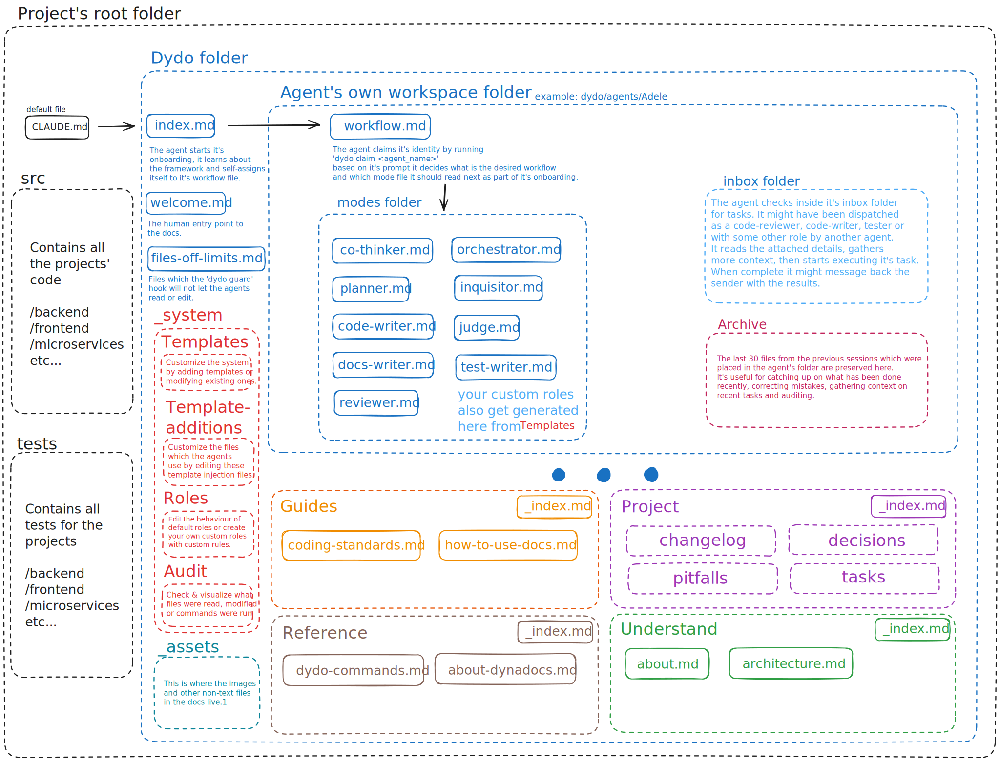

# DynaDocs (dydo)

A platform-agnostic AI orchestration and context-management framework.

100% local, 100% under your control.

## The Problem

AI code editors need persistence. Without it, each session starts fresh and the agent has to gather context about the project before it can even begin working on your actual task.

So we have to explain the same context each time.

Claude Code and Cursor don't have memory built in. Tools like Windsurf and Antigravity have some form of it, but you don't control it.

## The Solution

DynaDocs combines an agent-friendly documentation format with a CLI tool for deterministic rule enforcement and framework management.

You point your AI assistant to `index.md` (via CLAUDE.md or equivalent), and from there it goes through an onboarding process where it learns about the framework and how to use it.
Based on the prompt, it self-assigns to the appropriate workflow and mode and coordinates with other independent local agents.



---

## Installation

```bash
# npm (recommended)
npm install -g dydo

# if you have .NET installed
dotnet tool install -g DynaDocs
```

## Quick Start

### 1. Set up dydo in your project

Run from your project's root directory:

```bash
# If you use Claude Code
dydo init claude

# If you use something else
dydo init none
```

This creates the `dydo/` folder structure, templates, and configures Claude Code hooks automatically.

### 2. Link your AI entry point

Add this to your `CLAUDE.md` (or equivalent for other AI tools):

```markdown
Before starting any task, read [dydo/index.md](dydo/index.md) and follow the onboarding process.
```

### 3. For non-Claude Code users

If you're using a different AI tool, wire up a hook that calls `dydo guard` before file edits:

```bash
# CLI mode (simpler)
dydo guard --action edit --path src/file.cs

# Or pipe JSON via stdin (for tools that send structured data)
echo '{"tool_name":"Edit","tool_input":{"file_path":"src/file.cs"}}' | dydo guard
```

Exit code `0` = allowed, `2` = blocked (reason in stderr).

### 4. Validate your documentation

Dydo might expect a certain format to the documentation, especially around the foundation files (index.md, about.md),
links also need to be relative to better aid AI navigation, so it's a good idea to run these periodically.

```bash
dydo check    # Find issues
dydo fix      # Auto-fix what's possible
```

**Note:** It's recommended to use [Obsidian](https://obsidian.md) so it's easier to navigate the docs.
But if you move files Obsidian will not use relative links, so be sure to run `dydo fix`.

### 5. Customize the templates

Edit templates in `dydo/_system/templates/` to customize agent workflows and mode guidance. Changes take effect when agents are claimed (`dydo agent claim`).

---

## How It Works

**Example prompt:** `Hey Adele, help me implement authentication --feature`

1. The agent reads `CLAUDE.md`, gets redirected to `dydo/index.md`
2. From `index.md`, it navigates to its workspace: `dydo/agents/Adele/workflow.md`
3. It claims its identity: `dydo claim Adele`
4. The `--feature` flag tells it to follow: **interview → plan → code → review**
5. It sets its role: `dydo agent role interviewer --task auth`
6. On every file operation, the `dydo guard` hook enforces permissions based on the current role

**No self-review:** An agent that wrote code cannot review it. The system tracks role history per task and enforces fresh-eyes validation.

---
## Workflow Flags

| Flag | Workflow |
|------|----------|
| `--feature` | Interview → Plan → Code → Review |
| `--task` | Plan → Code → Review |
| `--quick` | Code only (simple changes) |
| `--think` | Co-thinker mode |
| `--review` | Reviewer mode |
| `--docs` | Docs-writer mode |
| `--test` | Tester mode |
---
## Agent Roles

| Role | Can Edit | Purpose |
|------|----------|---------|
| `code-writer` | `src/**`, `tests/**` | Implement features |
| `reviewer` | agent workspace | Review code |
| `planner` | `tasks/**`, agent workspace | Design implementation |
| `tester` | `tests/**`, `pitfalls/**`, agent workspace | Write tests, report bugs |
| `docs-writer` | `dydo/**` (except agents/) | Write documentation |
| `co-thinker` | `decisions/**`, agent workspace | Explore ideas |
| `interviewer` | agent workspace | Gather requirements |

---

## Folder Structure

```
project/
├── dydo.json                 # Configuration
├── CLAUDE.md - or equivalent # AI entry point
└── dydo/
    ├── index.md              # Documentation root
    ├── _system/templates/    # Customizable templates
    ├── understand/           # Domain concepts, architecture
    ├── guides/               # How-to guides
    ├── reference/            # API docs, specs
    ├── project/              # Decisions, pitfalls, changelog
    │   └── tasks/            # Cross-agent task handoff
    └── agents/               # Agent workspaces (gitignored)
```
---

## Commands
**Note:** The agents wil call many of the commands by themselves.

### Setup
| Command | Description |
|---------|-------------|
| `dydo init <integration>` | Initialize project (`claude`, `none`) |
| `dydo init <integration> --join` | Join existing project as new team member |
| `dydo whoami` | Show current agent identity |

### Documentation
| Command | Description |
|---------|-------------|
| `dydo check [path]` | Validate documentation |
| `dydo fix [path]` | Auto-fix issues |
| `dydo index [path]` | Regenerate index.md from structure |
| `dydo graph <file>` | Show graph connections for a file |

### Agent Lifecycle

| Command | Description |
|---------|-------------|
| `dydo agent claim <name\|auto>` | Claim an agent identity |
| `dydo agent release` | Release current agent |
| `dydo agent status [name]` | Show agent status |
| `dydo agent list [--free]` | List all agents |
| `dydo agent role <role> [--task X]` | Set role and permissions |

### Agent Management
| Command | Description |
|---------|-------------|
| `dydo agent new <name> <human>` | Create new agent |
| `dydo agent rename <old> <new>` | Rename an agent |
| `dydo agent remove <name>` | Remove agent from pool |
| `dydo agent reassign <name> <human>` | Reassign to different human |

### Workflow
| Command | Description |
|---------|-------------|
| `dydo dispatch --role <role> --task <name>` | Hand off work |
| `dydo inbox list` | List agents with inbox items |
| `dydo inbox show` | Show current agent's inbox |
| `dydo inbox clear` | Clear processed items |

### Tasks
| Command | Description |
|---------|-------------|
| `dydo task create <name>` | Create a new task |
| `dydo task ready-for-review <name>` | Mark task ready for review |
| `dydo task approve <name>` | Approve task (human only) |
| `dydo task reject <name>` | Reject task (human only) |
| `dydo task list` | List tasks |
| `dydo review complete <task>` | Complete a code review |

### Workspace
| Command | Description |
|---------|-------------|
| `dydo guard` | Check permissions (for hooks) |
| `dydo clean <agent>` | Clean agent workspace |
| `dydo workspace init` | Initialize agent workspaces |
| `dydo workspace check` | Verify workflow before session end |

---

## License

MIT
