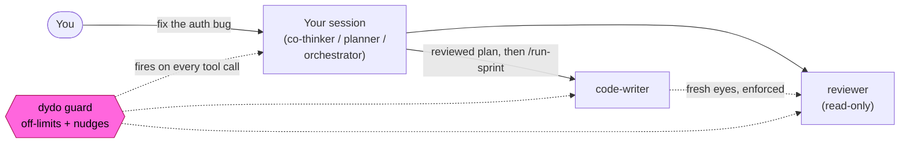

# DynaDocs (dydo)

Own your project's knowledge — then put agents to work on it.

DynaDocs (dydo) is a collection of tools and practices for working with AI coding systems better. It is four things: **AI-friendly documentation**, a **PM system** that lives in your repo (with an optional live Notion board), a **compilation engine** that gives Claude Code and Codex one source of truth for skills and agents, and a customizable set of **nudges** that keep every agent inside your rules.

The coding tool owns the engine — spawning, scheduling, isolation, fan-out. dydo owns the knowledge and the process.

<!-- VISUAL: demo video goes here. The old poem-orchestration video shows terminal-dispatch, which no longer exists in 2.0 — it needs re-recording. See "Demo video shot list" note handed to balazs. -->

## The Project That Remembers

The structure is the superpower. In a dydo project, decisions have records, bugs have issues, changes have a changelog — and all of it is markdown in your repo, human-readable, git-diffable, and written *for* AI consumption as much as for yours.

That changes what an agent can do for you. Ask "why didn't we use Astro here?" and it digs up the decision record from months ago — the actual reasoning, from when it happened — and checks whether the reason still holds. A bug surfaces? The changelog says when the behavior changed. An issue was filed weeks ago? Any session can pick it up with full context, because the context was never in someone's head or a lost chat log — it's in the tree.

AI coding tools have memory features, but that memory is unstructured, opaque, and not under your control. You can't organize it, version it, or review it in a pull request. dydo's split is deliberate: **CLAUDE.md or AGENTS.md is your rules, native memory is the agent's scratch notes, and dydo docs are curated, reviewed knowledge.** Agents onboard themselves each session by reading — progressive disclosure, not a context dump.

Turn on the optional Notion sync and the PM records become a live team board — a *view*, kept current by a daemon within seconds of any edit. The repo stays canonical; the data never leaves your control.

## Stop Doing Agent Work Yourself

Your time is the most precious resource in the equation. You should focus on your comparative advantage: deciding **what** should be done and **why** — articulating intent, making value choices, choosing direction. Everything that *can* be done by an agent *should* be.

Agents write code. Agents review code. Agents write tests. Agents write documentation. Agents coordinate other agents. The human is the last step, not the first reviewer. If it can be done by an agent, why waste your time on it?

There are two kinds of agents in a dydo project, and the difference is who you talk to:

- **The ones you work with** — co-thinker, planner, orchestrator, chief-of-staff. Thinking partners and coordinators, largely interchangeable hats for the session in front of you. You hash out a design, they turn it into a plan, they run the plan.
- **The ones you ideally never talk to** — code-writer, reviewer, test-writer, docs-writer. They don't improvise and they don't work from vibes: implementation only happens against a precise, reviewed plan, the code they produce is reviewed by fresh eyes that didn't write it, and only then does it merge.


```mermaid
flowchart LR
    H([You]) -->|"fix the auth bug"| S["Your session<br/>(co-thinker / planner /<br/>orchestrator)"]
    S -->|"reviewed plan, then /run-sprint"| W1["code-writer"]
    S --> W2["reviewer<br/>(read-only)"]
    W1 -.->|fresh eyes, enforced| W2
    G{{"dydo guard<br/>off-limits + nudges"}}
    G -.->|fires on every tool call| S
    G -.-> W1
    G -.-> W2
    style G fill:#f6d,stroke:#a15,color:#000
```

## The Four Things

### 1. AI-friendly docs + PM — the part nothing else gives you

A knowledge tree (`understand/`, `guides/`, `reference/`) and a PM spine (`project/`: decisions, issues, sprints, slices, tasks, changelog) with validation (`dydo check`), auto-fixing (`dydo fix`), and link/graph tooling. Records follow conventions agents know how to read and write. This is where the compounding value lives — everything else in dydo exists to serve it.

### 2. The compiler — one source of truth for every runtime

`dydo sync` compiles your role templates and docs into Claude Code's `.claude/agents/`, `.claude/skills/`, `.claude/workflows/` and Codex's `.codex/agents/`, `.agents/skills/`. A role is one markdown template — frontmatter for metadata, methodology as the body. Edit it once; both runtimes get it. No hand-maintained agent files, no drift between tools. Roles declare abstract model tiers (`strong` / `standard` / `light`); the compiler binds concrete models at sync time.

### 3. Nudges — your rules, enforced on every action

A guard hook fires on **every** tool call — the main thread and every subagent and workflow alike. Off-limits paths (secrets, system files) hard-block for everyone; your custom nudges (a regex plus your message) notice, warn-once, or block. You could build this with raw hooks yourself — dydo's way is cleaner, and it ships with sane defaults.

### 4. Opinionated setup in one command

`dydo init claude` (or `codex`) gives you the whole system — docs tree, PM records, role templates, guard hooks, entry files — in an opinionated shape that works out of the box. Then everything is yours to change: templates override, nudges are config, the docs are just markdown.

---

## How Work Runs

1. **Think** — hash out the design with a co-thinker; conclusions land as decision records, not chat history.
2. **Plan** — the planner turns a ripe design into a sprint: a specification with zero open questions, sliced into self-contained pieces. A fresh-eyes reviewer gates the plan before any code runs. *No plan, no code* — trivial edits excepted; if it needs a reviewer, it needs a plan.
3. **Build** — `run-sprint` loops each slice through code-writer → reviewer until the review passes, merges slices back serially, then audits the merged whole with fresh eyes.
4. **Verify** — at campaign ends, `inquisition` fans out read-only inquisitors across adversarial lenses (correctness, coverage gaps, security, dead code, doc drift) and verifies every finding before it reaches you.

The reviewer is the single quality gate throughout — one role with per-target rubrics (code, plans, docs, tests, merged sprints), shipped read-only so "reviewers don't write code" is the tool profile, not a polite request.

---

## Where dydo Came From — and Why It Got Smaller

dydo was born from a concrete pain: agents that assumed things, went ahead without structure, broke rules, and didn't read what mattered. The first versions answered with heavy machinery — identity, enforced onboarding, orchestrators dispatching workers into terminal tabs, messaging, queues, worktree plumbing.

Then the runtimes grew up. Claude Code and OpenAI shipped skills, governable subagents, native worktree isolation, and dynamic workflows — better and more native than dydo's hand-rolled versions, backed by more resources than we will ever have. Competing with that is stupid, and building features they haven't shipped *yet* is a race we'd lose the day they ship them.

So dydo simplified, deliberately, to the layer the runtimes won't build for you: **your project's knowledge, your process, your records** — and the thin compile-and-nudge machinery that plugs them into whatever runtime you use. The pivot itself is written down as decision records in the dydo repo, because dydo runs on its own system — the reasoning is there for anyone (human or agent) who asks "why did this get smaller?"

---

## Installation

```bash
# npm (recommended)
npm install -g dydo

# if you have .NET installed (faster install)
dotnet tool install -g dydo
```

---

## Quick Start

### 1. Set up dydo in your project

Run from your project's root directory:

```bash
dydo init claude
# or
dydo init codex
```

This creates the `dydo/` documentation tree, the templates, the runtime's guard hook, and the entry file (`CLAUDE.md` for Claude Code, `AGENTS.md` for Codex) that points every session at your docs.

### 2. Compile

```bash
dydo sync
```

Templates become native skills, agents, and workflows for your runtime. Re-run it whenever you change a template.

### 3. Fill in your context and validate

```bash
dydo check    # Find documentation issues
dydo fix      # Auto-fix what's possible
```

Fill out `about.md` with your project context and adjust `coding-standards.md` to your conventions — agents read these during onboarding. Edit `dydo.json` to set your project's source and test paths.

**Tip:** [Obsidian](https://obsidian.md) makes navigating the docs easier, but it rewrites links when you move files. Run `dydo fix` afterward.

### 4. Customize (optional)

- **Nudges** — a regex that blocks or warns with your own message, in `dydo.json`.
- **Roles** — edit a shipped role's template, or add `dydo/_system/templates/mode-<name>.template.md` for a new one; re-run `dydo sync`.
- **Template additions** — drop markdown into `dydo/_system/template-additions/`; templates have `{{include:name}}` hooks that survive `dydo template update`.

**Tip:** For anything advanced, don't hand-write the files. Talk it through with a co-thinker, point them at the [dydo repo](https://github.com/bodnarbalazs/dydo), and have them do it. Then `dydo validate`.

You're ready to go. Keep docs accurate to your intent — they're the memory your agents rely on.

---

## Notion Sync (optional)

Your repo files stay the single source of truth. Notion is a **swappable view** — a team-facing PM board that dydo provisions and keeps in two-way sync: releases, campaigns, sprints, slices, tasks, and issues, with a designed color language, priority scheme, and attention signals.

<!-- VISUAL: Notion board screenshot goes here — balazs to provide. Drop the PNG in dydo/_assets/ and add an image tag on this line. -->

```bash
dydo notion connect          # store your integration token (local-only by default)
dydo notion sync             # reconcile repo files ⇄ Notion
dydo notion sync --dry-run   # preview the reconcile plan, change nothing
dydo watchdog start          # the daemon: board stays current within ~15s
```

The daemon's sync cost scales with **what changed, not how much exists** — a quiet tick is a handful of filtered queries whether your doc base holds four hundred records or forty thousand. Edits land on the board within one ~15-second tick; a body-free hourly census catches remote deletions; the full reconcile only runs when you ask for it.

The token is read from stdin (never a CLI argument, never logged) and stored locally, or sealed into an opt-in, passphrase-encrypted vault (`--vault`) if you want it committed for CI. You own the data; Notion is just where your team looks at it.

---

## Folder Structure

```
project/
|-- dydo.json                    # Configuration (paths, model tiers, nudges, Notion)
|-- CLAUDE.md                    # Claude Code entry point <- dydo init
|-- AGENTS.md                    # Codex entry point <- dydo init
|-- .claude/
|   |-- agents/                  # Compiled Claude subagents <- dydo sync
|   |-- skills/                  # Compiled Claude role skills <- dydo sync
|   `-- workflows/               # Compiled workflows <- dydo sync
|-- .codex/agents/               # Compiled Codex agents <- dydo sync
|-- .agents/skills/              # Compiled Codex skills <- dydo sync
`-- dydo/
    |-- index.md                 # Documentation root
    |-- understand/              # Domain concepts, architecture
    |-- guides/                  # How-to guides
    |-- reference/               # API docs, specs
    |-- project/                 # Decisions, issues, sprints, slices, tasks, changelog
    |-- _system/templates/       # Customizable templates (roles, workflows, docs)
    |-- _system/template-additions/  # Template extension points
    |-- _assets/                 # Images, diagrams
    `-- agents/                  # Shared agent scratch workspace (gitignored)
```

---

## For Teams

Share one repo. Each member wires up their machine's local integration for an already-initialized project with:

```bash
dydo init codex --join
# or
dydo init claude --join
```

---

## Self-Documentation

dydo documents itself using its own system. Learn how it works by reading the `dydo/` folder in the [dydo GitHub repo](https://github.com/bodnarbalazs/dydo) — a living example of documentation-driven development.

---

## Command Reference

**Note:** Agents call most of these themselves. Commands frequently used by **humans** are **bold**; commands meant only for *agents* are *italic*.

### Setup
| Command | Description |
|---------|-------------|
| **`dydo init <integration>`** | **Initialize project (`claude`, `codex`, `none`)** |
| **`dydo init <integration> --join`** | **Join existing project as a new team member** |
| **`dydo sync`** | **Compile role templates to Claude and Codex agents, skills, and workflows** |
| `dydo validate` | Validate configuration and nudges |

### Documentation
| Command | Description |
|---------|-------------|
| **`dydo check [path]`** | **Validate documentation** |
| **`dydo fix [path]`** | **Auto-fix issues** |
| `dydo index [path]` | Regenerate index.md from structure |
| `dydo graph <file>` | Show graph connections for a file |
| `dydo graph stats [--top N]` | Show top docs by incoming links |

### Tasks & Reviews
| Command | Description |
|---------|-------------|
| `dydo task create <name>` | Create a task |
| *`dydo task ready-for-review <name> --summary "..."`* | *Mark task ready for review* |
| `dydo task done <name>` | Mark task done after verification |
| `dydo task list` | List tasks |
| *`dydo review complete <task>`* | *Complete a code review* |

### Issues
| Command | Description |
|---------|-------------|
| `dydo issue create --title "..." --area <area> --severity <level> --summary "..."` | Create an issue |
| `dydo issue list [--area <area>] [--all]` | List issues |
| `dydo issue resolve <id> --summary "..."` | Resolve an issue |

### Notion & Daemon
| Command | Description |
|---------|-------------|
| `dydo notion connect [--parent-page <id>] [--vault]` | Store the Notion token (local-only by default) |
| `dydo notion sync [--dry-run] [--prune]` | Reconcile repo files ⇄ Notion (the full pass) |
| `dydo notion reset [--dry-run] [--yes]` | Archive the tracked databases and recreate them from the model |
| `dydo notion reveal-token [--yes]` | Print the stored token (guarded break-glass) |
| **`dydo watchdog start [--interval <s>] [--census-interval <n>]`** | **Start the sync daemon (15s ticks by default)** |
| **`dydo watchdog stop`** | **Stop the sync daemon** |

### Model
| Command | Description |
|---------|-------------|
| `dydo model cap <model> --until <time> [--fallback <model>]` | Rebind an unavailable model's tiers to a fallback until a reset time |
| `dydo model uncap <model>` | Restore a capped model's tier bindings |
| `dydo model status` | Show active model caps (target, fallback, reset time) |

### Guard
| Command | Description |
|---------|-------------|
| `dydo guard` | Check permissions (for hooks) |

### Template
| Command | Description |
|---------|-------------|
| **`dydo template update`** | **Update framework templates and docs** |
| `dydo template update --diff` | Preview changes without writing |

### Utility
| Command | Description |
|---------|-------------|
| `dydo version` | Display version |

---

## License

AGPL-3.0 — [github.com/bodnarbalazs/dydo](https://github.com/bodnarbalazs/dydo)

**Free to use, always.** You can use dydo as a tool on any project, including commercial ones. The AGPL obligations apply only if you modify or embed dydo's source code in your own software — for example, shipping dydo as part of a product you distribute or offer as a service.

For commercial licensing without AGPL obligations, [open a GitHub issue](https://github.com/bodnarbalazs/dydo/issues).
