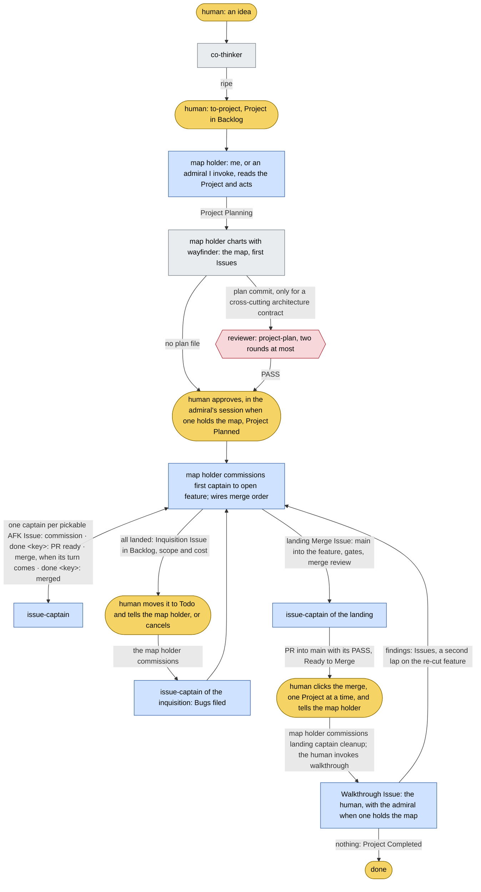
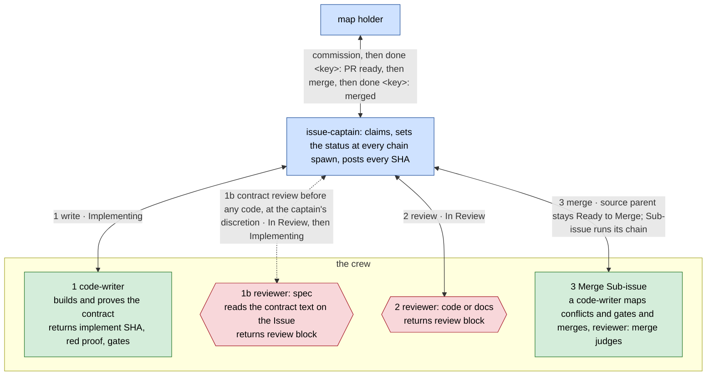

# Dydo

## What it is
Dydo is my opinionated workflow to build software projects with agents.
It has:
- Skills
	- Telling agents how to get work done, what roles they should play and how they should interact with the other agents
- A CLI tool which
	- Scaffolds the docs and wires the guard hook into Codex and Claude Code
	- Has a nudge system which uses Regex patterns in a guard hook to deny/warn on agent actions with helpful messages like
		- Don't hand-edit migrations, use "X" instead.
		- Don't invoke "this command" like this use it "like this"
	- Provides other handy commands like
		- Proxies a python swiss-army knife test runner script
		- Checks for broken links in the docs
- Documentation structure
	- [Diátaxis](https://diataxis.fr/) inspired structure
		- Guides
		- Reference
		- Understand
		- Project
		- Glossary
	- Auto generated placeholder files like
		- About
		- Architecture
		- Coding Standards

## How to use it
Don't. Seriously. Build your own system.
Because it should reflect:
- How you work
- What you work on
- With what stack
- What "good" (code) looks like to you

So I suggest you cherry pick ideas, fork the project, point your agent at it, steal what you need.
You can use it as is (as I use it), but it will reflect MY values and not necessarily yours.
It is built to be customizable, but only to a degree. If you still want to give it a try as is point your agent to [Getting Started](https://github.com/bodnarbalazs/dydo/blob/master/dydo/guides/getting-started.md) and follow their instructions.

## Rant (feel free to skip)
I started building DyDo, back then DynaDocs, "Dynamic documentation", because Claude didn't work like I wanted it to. Every time I had to reexplain it things about the project, what its job would be, what it shouldn't mess up (and it did every new session if I didn't tell it) and the Claude.md just wasn't enough. So I "invented" an onboarding system where the Claude.md would tell them that they were invoked with either a name like "Adele" or they should "claim" their own identity then follow the further instructions inside their folder which doubled as their workspace as well. So "Adele" arrived at "Project/dydo/agents/Adele/index.md" and was presented with a choice on what role they would play. There were co-thinker, planner, code-writer, test-writer, docs-writer, reviewer, later orchestrator, inquisitor. And then they would be presented with their job-description, tools, and access. Because co-thinkers couldn't write code outside of their workspace, code-writers couldn't write tests, test-writers couldn't have access to the rest of the code (yes, this was stupid in hindsight).
The guard enforced all of this. If they didn't claim their identity they couldn't even read files not needed for that. If they didn't read the files which were the "must reads" for their role they couldn't read or write, they couldn't get their task done otherwise. I didn't want to waste the context and attention on coding-standards of an agent who is brainstorming with me and someone whose job is to write the damn code shouldn't be bored with what the docs structure looks like. Progressive disclosure reinvented from first principles.
Then I felt like a flight-traffic controller juggling many agents so I made orchestrator agents. Mind you this was way before sub-agents were a thing. It was glorious. These agents were able to use "dydo dispatch" to open a new terminal and spin up another top-level agent in it, which would onboard, look at its inbox and start to work. 4-5 terminal tabs in each terminal window. Then I got tired of closing them when they were done so I added that as well. And it worked all nice until the terminal app crashed and I had to clean up stale identities and try to resume sessions.
Then in 2.0 I learned the lesson that I shouldn't build stuff which OpenAI and Anthropic would build anyways - and build it better, because this is not my main product, it's theirs. The goal is that dydo should be my workflow and customization on top of their harnesses. So I embraced skills (and I no longer enforce that they actually read them). In 2.0 I had a Notion sync and view cooked up so it would provide a better interface to interact with the project management records. I didn't like it. So in 3.0 I made the explicit decision that this should support my work and I won't think about "backwards compatibility" or generally anything which I would do if this was a product meant to be used by others. I built the entire new system around Matt Pocock's wayfinder skill and the divide and conquer idea within it. I had adapted a bunch of other skills from others like: [Matt Pocock](https://github.com/mattpocock/skills), [HumanLayer](https://github.com/humanlayer/skills), Lauren Tan's [pstack](https://github.com/cursor/plugins) (full list in [THIRD-PARTY-NOTICES.md](https://github.com/bodnarbalazs/dydo/blob/master/THIRD-PARTY-NOTICES.md)) and harmonized them with each other. I also gave up on hand rolling the PM layer and adopted Linear as the platform to use and removed all the Notion sync stuff.

## Overview
So how does dydo work in practice?

I break the work with a software product into many Linear projects. Each project is a map, where the issues are the nodes, they are marked with statuses and labels. By default I hold the map myself and chart it with wayfinder in my own session; when I want throughput (AFK work overnight) I invoke an Admiral to hold it for me. Whoever holds the map charts it, manages the PM surface and coordinates the Issue Captains who oversee the completion of the Issues with their crew of (code-writers, docs-writers, reviewers, inquisitors, researchers and scouts).

Each issue is either AFK or HITL
- AFK is completed without me if everything goes according to plan
- HITL happens with my direct involvement and guidance

These are the types of issues:
- Feature
	- Some new feature is being built or improved upon
- Bug
	- A bug gets reported, then it gets reproduced and fixed
- Enablement
	- Some human-involved setup which other work depends on (creating an api key)
- Inquisition
	- An audit where sub agents not only look at the code like reviewers, but also try to come up with ways which it could break and they test these hypotheses out to verify them
- Grilling
	- An agent asks me questions about my intent and vision, I understand and weigh the choices and out of these sessions come Decision Records, plans and further issues which can be navigated
- Merge
	- Each project is a feature branch, each issue where code gets written is a sub branch and each lane or sub issue within that issue also gets its child branch so agents never collide. When these are merged back to their parent, it's a merge issue.
- Prototype
	- An interactive session where throwaway code gets created mostly for UI decisions, the winner code may become preserved as a starting guide for the actual implementation
- Question
	- When some decision is needed which is not answerable from any previous artifact (implementation plan, DR, docs, etc.) work stops until it's resolved so things don't go in incorrect ways
- Research
	- When some question needs to be answered there is a research work where an agent sends out scouts then verifies the evidence and presents the findings
- Walkthrough
	- Happens each time the feature is merged back to master (or when requested), this is the final, hands-on review where things get spot checked by me and I get in touch with the codebase so I understand what's going on and if I don't like something I'll send it back to be fixed

Here are some nice charts about the workflow:

One Project, from idea to walkthrough:


```mermaid
flowchart TD
  classDef human fill:#f6d365,stroke:#8a6d00,color:#000
  classDef session fill:#e9ecef,stroke:#6c757d,color:#000
  classDef officer fill:#cfe2ff,stroke:#2c5aa0,color:#000
  classDef crew fill:#d4edda,stroke:#2e7d32,color:#000
  classDef reviewer fill:#f8d7da,stroke:#a71d2a,color:#000

  H0([human: an idea]):::human --> CT[co-thinker]:::session
  CT -->|ripe| TP([human: to-project, Project in Backlog]):::human
  TP --> AD[map holder: me, or an admiral I invoke, reads the Project and acts]:::officer
  AD -->|Project Planning| PP[map holder charts with wayfinder: the map, first Issues]:::session
  PP -->|plan commit, only for a cross-cutting architecture contract| RP{{reviewer: project-plan, two rounds at most}}:::reviewer
  PP -->|no plan file| H1
  RP -->|PASS| H1([human approves, in the admiral's session when one holds the map, Project Planned]):::human
  H1 --> OP[map holder commissions first captain to open feature; wires merge order]:::officer
  OP <-->|"one captain per pickable AFK Issue: commission · done &lt;key&gt;: PR ready · merge, when its turn comes · done &lt;key&gt;: merged"| IC[issue-captain]:::officer
  OP -->|all landed: Inquisition Issue in Backlog, scope and cost| H2([human moves it to Todo and tells the map holder, or cancels]):::human
  H2 -->|the map holder commissions| IQ[issue-captain of the inquisition: Bugs filed]:::officer
  IQ --> OP
  OP -->|landing Merge Issue: main into the feature, gates, merge review| LM[issue-captain of the landing]:::officer
  LM -->|PR into main with its PASS, Ready to Merge| H3([human clicks the merge, one Project at a time, and tells the map holder]):::human
  H3 -->|map holder commissions landing captain cleanup; the human invokes walkthrough| WT[Walkthrough Issue: the human, with the admiral when one holds the map]:::officer
  WT -->|findings: Issues, a second lap on the re-cut feature| OP
  WT -->|nothing: Project Completed| END([done]):::human
```

One Issue, inside its captain's loop:


```mermaid
flowchart TD
  classDef officer fill:#cfe2ff,stroke:#2c5aa0,color:#000
  classDef crew fill:#d4edda,stroke:#2e7d32,color:#000
  classDef reviewer fill:#f8d7da,stroke:#a71d2a,color:#000

  AD[map holder]:::officer <-->|"commission, then done &lt;key&gt;: PR ready, then merge, then done &lt;key&gt;: merged"| IC[issue-captain: claims, sets the status at every chain spawn, posts every SHA]:::officer
  IC <-->|"1 write · Implementing"| CW
  IC <-.->|"1b contract review before any code, at the captain's discretion · In Review, then Implementing"| RS
  IC <-->|"2 review · In Review"| RC
  IC <-->|"3 merge · source parent stays Ready to Merge; Sub-issue runs its chain"| MG
  subgraph CREW [the crew]
    CW[1 code-writer<br>builds and proves the contract<br>returns implement SHA, red proof, gates]:::crew
    RS{{1b reviewer: spec<br>reads the contract text on the Issue<br>returns review block}}:::reviewer
    RC{{2 reviewer: code or docs<br>returns review block}}:::reviewer
    MG[3 Merge Sub-issue<br>a code-writer maps conflicts and gates and merges, reviewer: merge judges]:::crew
  end
```

here's the further workflow documented: [Control Flow](https://github.com/bodnarbalazs/dydo/blob/master/dydo/understand/control-flow.md)
and here's the Linear setup dydo and the agents expect: [Linear Workspace Standard](https://github.com/bodnarbalazs/dydo/blob/master/dydo/reference/linear-workspace-standard.md)

## Installation

```bash
# npm (recommended)
npm install -g dydo

# .NET global tool
dotnet tool install -g dydo
```

## Quick start

Run from the project root:

```bash
dydo init codex       # or: dydo init claude / dydo init all / dydo init none
dydo check            # validate the documentation tree
dydo fix              # repair supported documentation issues
```

Every mode writes `dydo.json`, the `dydo/` documentation tree and `CLAUDE.md`. The `claude`, `codex`
and `all` modes also wire `dydo guard` as a hook for the chosen hosts, set the host's agent spawn
depth, and add the host's skill folder to `.gitignore`; Codex selections add `AGENTS.md`. `none`
wires no host. Initialization creates durable Decisions, changelog, pitfalls and FutureFeature
documentation; live work stays in Linear.

Fill in `dydo/understand/about.md` and `dydo/understand/architecture.md`, then adapt
`dydo/guides/coding-standards.md` and `dydo.json` to the project. Use `dydo init <integration> --join`
when wiring another host or machine into an existing project. The full checklist, Linear workspace
and host configuration included, is
[Getting Started](https://github.com/bodnarbalazs/dydo/blob/master/dydo/guides/getting-started.md).

## Install the skills

The skills do not come with the npm or .NET package, and `dydo init` does not write them. Each skill
is one plain `skills/<category>/<name>/` folder in the [dydo repository](https://github.com/bodnarbalazs/dydo).
Before the first agent session:

1. Copy `skills/`, `setup-skills.mjs` and `THIRD-PARTY-NOTICES.md` from the dydo repository into
   the project root. The notices carry the MIT licences of the adapted skills and travel with them.
2. Commit them. They are the project's own from then on: edit them in place; nothing reconciles them
   with later dydo versions.
3. Run `node setup-skills.mjs`. It links every skill folder, flat, into `.claude/skills/` and
   `.agents/skills/`.

The script always creates both folders, but `dydo init` and every `dydo init <integration> --join`
add only the wired host's folder to `.gitignore`: `/.claude/skills/` for Claude Code,
`/.agents/skills/` for Codex. A single-host project adds the other folder's line itself, or wires
both hosts with `all`. Each clone runs `node setup-skills.mjs` once. The script is safe to rerun. It checks its whole plan
before creating anything, stops at the first collision it names, and never replaces host
configuration or unrelated skills. OpenCode may read the same two folders; that is untested, and
dydo has no OpenCode init mode.

## Commands

| Command | Description |
|---|---|
| `dydo init <integration>` | Initialize for `claude`, `codex`, `all`, or `none` |
| `dydo init <integration> --join` | Wire another host or machine into an existing project |
| `dydo check [path]` | Validate documentation |
| `dydo fix [path]` | Apply supported documentation repairs |
| `dydo index [path]` | Regenerate documentation indexes |
| `dydo graph <file>` | Show document graph connections |
| `dydo graph stats [--top N]` | Rank documents by incoming links |
| `dydo guard` | Evaluate one tool call against the hook rules and nudges (run by the hooks) |
| `dydo validate` | Validate local configuration and nudges |
| `dydo gap-check [args]` | Run the test runner configured in `dydo.json`, passing the arguments through |
| `dydo completions <shell>` | Print a completion script for `bash`, `zsh`, or `powershell` |
| `dydo version` | Print the version |
| `dydo help` | Print the command summary |

Options, examples and exit codes are in the
[command reference](https://github.com/bodnarbalazs/dydo/blob/master/dydo/reference/dydo-commands.md).

## License

MIT — see LICENSE.
