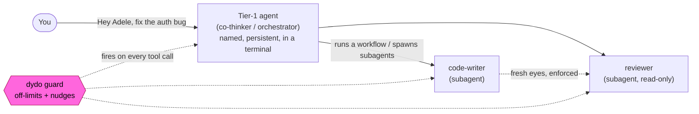
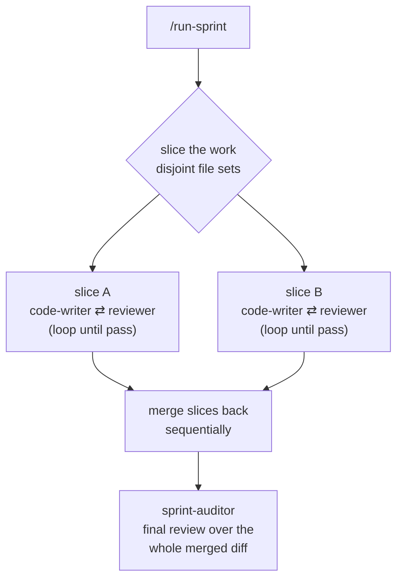

# DynaDocs (dydo)

Own your project's knowledge — then put agents to work on it.

DynaDocs (dydo) is the **policy and context layer** for AI coding agents. It gives native coding-agent runtimes structured, versioned project knowledge to work from, and a guard that enforces your rules of the road on every action they take. **The coding tool owns the engine - spawning, scheduling, isolation, fan-out. dydo owns the map and the rules.**

Your knowledge lives in your repo as human-readable, git-diffable docs — the single source of truth. Turn on the optional Notion sync and your team gets a live PM board as a *view*; the data never leaves your control.

**Built for Claude Code and Codex.** dydo wires guard hooks for both runtimes and compiles roles into their native agents and skills.

<!-- VISUAL: demo video goes here. The old poem-orchestration video shows terminal-dispatch, which no longer exists in 2.0 — it needs re-recording. See "Demo video shot list" note handed to balazs. -->

## Stop Doing Agent Work Yourself

Your time is the most precious resource in the equation. You should focus on your comparative advantage: deciding **what** should be done and **why** — articulating intent, making value choices, choosing direction. Everything that *can* be done by an agent *should* be.

Agents write code. Agents review code. Agents write tests. Agents write documentation. Agents coordinate other agents. The human is the last step, not the first reviewer. If it can be done by an agent, why waste your time on it?

dydo makes this dependable. On its own, an AI agent starts every session cold and works without rails. dydo fixes both: it gives agents **persistent, structured memory** (your docs), **enforced guardrails** (a guard hook that fires on every action — including inside subagents and workflows), and a **compiler** that turns your roles and docs into the native agents and skills. You describe what you want. Agents figure out the rest — inside the lines you drew.



### The context problem

AI coding tools have memory features — but that memory is unstructured, opaque, and not under your control. You can't organize it, version it, review it in a pull request, or decide what each role is allowed to see.

dydo gives you explicit, structured control over project context. Your documentation is the versioned, human-readable source of truth. Agents onboard themselves each session by reading it. You decide what's documented, how it's organized, and what each role needs to know. Runtime-native memory still works alongside it — the split is deliberate: **CLAUDE.md or AGENTS.md is your rules, native memory is the agent's scratch notes, and dydo docs are curated, reviewed knowledge.**

### What you get

- **Documentation as memory** — Your docs are the source of truth; agents re-read them each session, and `dydo sync` preloads the right context into each role.
- **Universal guardrails** — Off-limits paths (hard block) and custom nudges (regex → block or warn) enforced on *every* tool call, in the main thread **and** inside every subagent and workflow. This is the crown jewel.
- **Compiles to native artifacts** - `dydo sync` turns your roles and docs into Claude `.claude/agents/` / `.claude/skills/` and Codex `.codex/agents/` / `.agents/skills/`. No hand-maintained agent files.
- **Read-only roles, natively enforced** — The reviewer agent ships without Edit/Write tools. "Reviewers don't write code" isn't a policy, it's the tool profile.
- **No self-review** — The agent that wrote the code doesn't review it. Fresh eyes, by construction.
- **Native orchestration** — Fan out dozens of subagents through runtime-native workflows. Ships flagship workflows: `run-sprint` (sliced code→review→merge→audit) and `inquisition` (multi-lens QA gate).
- **Model tiers** — Roles declare an abstract tier (`strong` / `standard` / `light`) and effort; the compiler binds the concrete model. Swap models without touching a workflow.
- **Worktree isolation** — Parallel agents work in separate git worktrees without stepping on each other.
- **Notion as a view (optional)** — Two-way sync to a team PM board. Repo files stay canonical; the token is stored locally (or in an opt-in encrypted vault) and never committed by default.
- **Team support** — Each team member gets their own pool of agents.
- **Your process, your rules** — Templates, roles, and nudges are all yours to modify.

---

## What Changed in 2.0.0

Almost everything. Earlier versions shipped dydo's *own* multi-agent runtime — orchestrators dispatching workers into terminal tabs, with inbox, messaging, queues, and worktree plumbing to coordinate them. Then Claude Code introduced dynamic workflows and governable subagents, and dydo's hand-rolled orchestration was suddenly *fighting* the native runtime instead of riding it. That's a bad place to be.

So 2.0 pivots: **the coding-agent runtime owns orchestration** (subagents, skills, workflows), and **dydo becomes the policy + context layer** that plugs into it — keeping and sharpening the parts with no native equivalent.

- **Gone** — worker-tier dispatch, inbox/messaging/queues for workers, per-role RBAC path matrices, the audit-replay trail, and the `inquisitor`/`judge` roles.
- **Now native** — subagents and workflows do the fan-out; worktree isolation handles parallel collisions; `run-sprint` and `inquisition` are workflows. (The inquisitor/judge *roles* are retired; the inquisitor is reborn as a dedicated read-only agent the `inquisition` workflow spawns, and per-sprint auditing is the `sprint-auditor`.)
- **New** — `dydo sync` (the compiler), two-tier identity, model tiers, un-suppressed native memory, and optional two-way Notion sync.
- **Kept & sharpened** — the guard (now universal off-limits + nudges, firing *inside* subagents and workflows too) and the whole documentation system.

See [Decision 024](https://github.com/bodnarbalazs/dydo/blob/master/dydo/project/decisions/024-dydo-2-native-pivot.md) for the full rationale.

---

## Installation

```bash
# npm (recommended)
npm install -g dydo

# if you have .NET installed (faster install)
dotnet tool install -g dydo
```

**Note:** Set the `DYDO_HUMAN` environment variable so agents know who they belong to:

```powershell
# Windows (PowerShell)
[Environment]::SetEnvironmentVariable("DYDO_HUMAN", "YourName", "User")
```

```bash
# macOS / Linux (add to ~/.bashrc or ~/.zshrc)
export DYDO_HUMAN="YourName"
```

### Terminal Compatibility

Launching a named Tier-1 agent in a new terminal tab/window uses your OS terminal. Supported:

- **Windows:** Windows Terminal (Windows 11)
- **macOS:** iTerm2 recommended

---

## Quick Start

### 1. Set up dydo in your project

Run from your project's root directory:

```bash
dydo init claude
# or
dydo init codex
```

This creates the `dydo/` documentation tree, templates, and configures the selected runtime's guard hook automatically.

### 2. Compile your roles into native agents

```bash
dydo sync
```

This emits Claude `.claude/agents/` / `.claude/skills/` and Codex `.codex/agents/` / `.agents/skills/` from your role and doc definitions. Re-run it whenever you change a role or its context.

### 3. Link your AI entry point

Add this to your runtime entry point (`CLAUDE.md` for Claude Code, `AGENTS.md` for Codex):

```markdown
This project uses an agent orchestration framework (dydo).
Before starting any task, read [dydo/index.md](dydo/index.md) and follow the onboarding process.
```

### 4. Fill in your context and validate

```bash
dydo check    # Find documentation issues
dydo fix      # Auto-fix what's possible
```

Fill out `about.md` with your project context and adjust `coding-standards.md` to your conventions — agents read these during onboarding. Edit `dydo.json` to set your project's source and test paths.

**Tip:** [Obsidian](https://obsidian.md) makes navigating the docs easier, but it rewrites links when you move files. Run `dydo fix` afterward.

### 5. Customize (optional)

- **Nudges** — project-specific guardrails: a regex that blocks or warns with your own message.
- **Roles** — customize the shipped roles or scaffold new ones with `dydo roles create <name>`; re-run `dydo sync`.
- **Template additions** — drop markdown into `dydo/_system/template-additions/`; templates have `{{include:name}}` hooks that survive `dydo template update`.

**Tip:** For anything advanced, don't hand-write the files. Talk it through with a co-thinker, point them at the [dydo repo](https://github.com/bodnarbalazs/dydo), lift the guard for them (`dydo guard lift <agent> 5`), and have them do it. Then `dydo validate`.

You're ready to go. Keep docs accurate to your intent — they're the memory your agents rely on.

---

## How It Works

**Example prompt:** `Hey Adele, help me fix this bug in the auth service`

1. The named **Tier-1 agent** reads `CLAUDE.md` or `AGENTS.md`, gets redirected to `dydo/index.md`, and onboards through the doc funnel.
2. It claims its identity (`dydo agent claim Adele`) and reads the project context it needs.
3. It **plans the work and runs it as native subagents/workflows** — a code-writer to implement, a reviewer to check. Tier-1 manages; the workers execute. (Tier-1 agents are managers: the code writes happen in workers, not in the thread you're talking to.)
4. On **every** tool call — the main thread and each subagent alike — the `dydo guard` hook enforces universal off-limits and your nudges.
5. Review is separated by construction: the agent that wrote the code doesn't review it.

Two tiers of identity make this work:

| Tier | Who | Form |
|------|-----|------|
| **Tier 1** | co-thinker, orchestrator, chief-of-staff — the agents you talk to | Named, persistent identity; one per terminal; claims with `dydo agent claim` |
| **Tier 2** | code-writer, reviewer, test-writer, docs-writer, sprint-auditor, inquisitor | Runtime-managed subagents; identity = agent type + instance; **no claim**, spawned on demand |

---

## Multi-Agent Orchestration

For real work, a Tier-1 agent fans work out across native subagents and workflows. Two flagship skills ship with dydo:



- **`run-sprint`** — Slice a sprint into disjoint work, run automated code→review loops per slice (escalating to a human when a worker raises its hand), merge passed slices back, then run a `sprint-auditor` over the entire merged diff.
- **`inquisition`** — A campaign-end QA gate: fans out `inquisitor` subagents across five adversarial lenses (correctness, coverage gaps, security, dead code, doc drift), verifies each finding refute-by-default, and gates on confirmed high-severity issues. Its signature concern is test-coverage gaps — what a per-change review never checks.
- **Worktree isolation** — Parallel workers run in separate git worktrees (`isolation: 'worktree'`) so they never collide.
- **Nested orchestration** — Subagents can't spawn subagents; deeper fan-out is a nested workflow or another Tier-1 terminal.

---

## Agent Roles

dydo ships **seven base roles**. `dydo sync` compiles each into the native artifacts your coding runtime runs.

| Role | Purpose | Compiles to |
|------|---------|-------------|
| **chief-of-staff** | The human's right hand — triages the backlog, routes work, reports status | Skill (Tier-1 manager) |
| **co-thinker** | Collaborates on design decisions and architecture | Skill (Tier-1 manager) |
| **orchestrator** | Coordinates multi-agent workflows and dispatch | Skill (Tier-1 manager) |
| **code-writer** | Implements features and fixes bugs | Agent + skill (worker) |
| **reviewer** | Reviews code for quality and correctness | Agent + skill (worker, read-only) |
| **test-writer** | Writes and maintains test suites | Agent + skill (worker) |
| **docs-writer** | Creates and maintains documentation | Agent + skill (worker) |

Plus three that aren't claimable roles: **planner** (a planning-discipline skill a Tier-1 agent applies in its own thread), and **sprint-auditor** and **inquisitor** — read-only QA agents that workflows spawn, for whole-sprint audits and campaign-end QA sweeps respectively.

Roles are data-driven — defined in `.role.json` files. Add custom roles with `dydo roles create <name>`, then `dydo sync`. Each role declares a **model tier** (`strong` / `standard` / `light`), which the compiler binds to a concrete model at sync time.

---

## Notion Sync (optional)

Your repo files stay the single source of truth. Notion is a **swappable view** — a team-facing PM board that dydo provisions and keeps in two-way sync: tasks, issues, decisions, and progress, with a designed color language, priority scheme, and attention signals.

<!-- VISUAL: Notion board screenshot goes here — balazs to provide. Drop the PNG in dydo/_assets/ and add an image tag on this line. -->

```bash
dydo notion connect          # store your integration token (local-only by default)
dydo notion sync             # reconcile repo files ⇄ Notion
dydo notion sync --dry-run   # preview the reconcile plan, change nothing
```

The token is read from stdin (never a CLI argument, never logged) and stored locally, or sealed into an opt-in, passphrase-encrypted vault (`--vault`) if you want it committed for CI. You own the data; Notion is just where your team looks at it.

---

## Folder Structure

```
project/
|-- dydo.json                    # Configuration (paths, roles, model tiers, Notion)
|-- CLAUDE.md                    # Claude Code entry point
|-- AGENTS.md                    # Codex entry point
|-- .claude/
|   |-- agents/                  # Compiled Claude subagents <- dydo sync
|   `-- skills/                  # Compiled Claude role skills <- dydo sync
|-- .codex/agents/               # Compiled Codex agents <- dydo sync
|-- .agents/skills/              # Compiled Codex skills <- dydo sync
`-- dydo/
    |-- index.md                 # Documentation root
    |-- understand/              # Domain concepts, architecture
    |-- guides/                  # How-to guides
    |-- reference/               # API docs, specs
    |-- project/                 # Decisions, issues, tasks, backlog, changelog
    |-- _system/templates/       # Customizable templates
    |-- _system/template-additions/  # Template extension points
    |-- _system/roles/           # Role definitions (.role.json)
    |-- _assets/                 # Images, diagrams
    `-- agents/                  # Tier-1 agent workspaces (gitignored)
```

---

## For Teams

Each team member gets their own pool of agents — no conflicts. Join an existing project with:

```bash
dydo init codex --join
# or
dydo init claude --join
```

---

## Self-Documentation

dydo documents itself using its own system. Learn how it works by reading the `dydo/` folder in the [dydo GitHub repo](https://github.com/bodnarbalazs/dydo) — a living example of documentation-driven orchestration.

---

## Command Reference

**Note:** Agents call most of these themselves. Commands frequently used by **humans** are **bold**; commands meant only for *agents* are *italic*.

### Setup
| Command | Description |
|---------|-------------|
| **`dydo init <integration>`** | **Initialize project (`claude`, `codex`, `none`)** |
| **`dydo init <integration> --join`** | **Join existing project as a new team member** |
| **`dydo sync`** | **Compile roles to Claude and Codex agents + skills** |
| `dydo validate` | Validate configuration and roles |
| *`dydo whoami`* | *Show current agent identity* |

### Documentation
| Command | Description |
|---------|-------------|
| **`dydo check [path]`** | **Validate documentation** |
| **`dydo fix [path]`** | **Auto-fix issues** |
| `dydo index [path]` | Regenerate index.md from structure |
| `dydo graph <file>` | Show graph connections for a file |
| `dydo graph stats [--top N]` | Show top docs by incoming links |

### Agent Lifecycle (Tier-1)
| Command | Description |
|---------|-------------|
| *`dydo agent claim <name\|auto>`* | *Claim an agent identity* |
| *`dydo agent release`* | *Release current agent* |
| *`dydo agent status [name]`* | *Show agent status* |
| **`dydo agent list [--free] [--all]`** | **List agents** |
| **`dydo agent tree`** | **Show dispatch hierarchy of active agents** |
| *`dydo agent role <role> [--task X]`* | *Set role* |
| **`dydo agent clean <agent>`** | **Clean agent workspace** |

### Agent Management
| Command | Description |
|---------|-------------|
| `dydo agent new <name> <human>` | Create new agent |
| `dydo agent rename <old> <new>` | Rename an agent |
| `dydo agent remove <name>` | Remove agent from pool |
| `dydo agent reassign <name> <human>` | Reassign to different human |

### Coordination (Tier-1)
| Command | Description |
|---------|-------------|
| *`dydo dispatch --role <role> --task <name> --brief "..."`* | *Launch a named Tier-1 agent in a terminal* |
| *`dydo inbox list`* / *`dydo inbox show`* / *`dydo inbox clear --all`* | *List / show / archive inbox items* |
| *`dydo read <target>`* | *Print an inbox item or file and register the read (host-agnostic ack)* |
| *`dydo msg --to <agent> [--subject <task>] --body "..."`* | *Message another agent* |
| *`dydo wait [--task <name>] [--cancel]`* | *Wait for an incoming message* |
| *`dydo hand raise`* / *`dydo hand lower`* | *Raise / clear the needs-human flag* |

### Tasks & Reviews
| Command | Description |
|---------|-------------|
| `dydo task create <name>` | Create a task |
| *`dydo task ready-for-review <name> --summary "..."`* | *Mark task ready for review* |
| **`dydo task approve <name>`** / **`--all`** | **Approve task(s) (human only)** |
| `dydo task reject <name>` | Reject task (human only) |
| `dydo task list` | List tasks |
| *`dydo review complete <task>`* | *Complete a code review* |

### Issues
| Command | Description |
|---------|-------------|
| `dydo issue create --title "..." --area <area> --severity <level> --summary "..."` | Create an issue |
| `dydo issue list [--area <area>] [--all]` | List issues |
| `dydo issue resolve <id> --summary "..."` | Resolve an issue |

### Notion
| Command | Description |
|---------|-------------|
| `dydo notion connect [--parent-page <id>] [--vault]` | Store the Notion token (local-only by default) |
| `dydo notion sync [--dry-run] [--prune]` | Reconcile repo files ⇄ Notion |
| `dydo notion reset [--dry-run] [--yes]` | Wipe the tracked databases and recreate them from the model |
| `dydo notion reveal-token [--yes]` | Print the stored token (guarded break-glass) |

### Model
| Command | Description |
|---------|-------------|
| `dydo model cap <model> --until <time> [--fallback <model>]` | Rebind an unavailable model's tiers to a fallback until a reset time |
| `dydo model uncap <model>` | Restore a capped model's tier bindings |

### Roles
| Command | Description |
|---------|-------------|
| `dydo roles list` | List all role definitions |
| `dydo roles create <name>` | Scaffold a custom role |
| `dydo roles reset` | Regenerate base role files |

### Workspace & Guard
| Command | Description |
|---------|-------------|
| `dydo guard` | Check permissions (for hooks) |
| **`dydo guard lift <agent> [minutes]`** | **Temporarily lift guard restrictions** |
| `dydo guard restore <agent>` | Restore guard restrictions |
| *`dydo workspace init`* | *Initialize agent workspaces* |
| *`dydo workspace check`* | *Verify workflow before session end* |
| `dydo worktree <...>` | Manage git worktrees for parallel agents |
| `dydo watchdog <...>` | Manage the auto-close / attention watchdog |

### Template
| Command | Description |
|---------|-------------|
| **`dydo template update`** | **Update framework templates and docs** |
| `dydo template update --diff` | Preview changes without writing |

### Utility
| Command | Description |
|---------|-------------|
| `dydo version` | Display version |

---

## License

AGPL-3.0 — [github.com/bodnarbalazs/dydo](https://github.com/bodnarbalazs/dydo)

**Free to use, always.** You can use dydo as a tool on any project, including commercial ones. The AGPL obligations apply only if you modify or embed dydo's source code in your own software — for example, shipping dydo as part of a product you distribute or offer as a service.

For commercial licensing without AGPL obligations, [open a GitHub issue](https://github.com/bodnarbalazs/dydo/issues).
