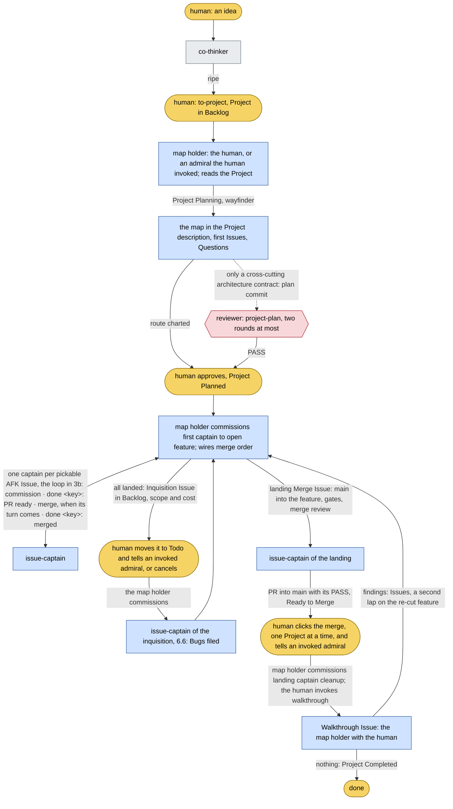
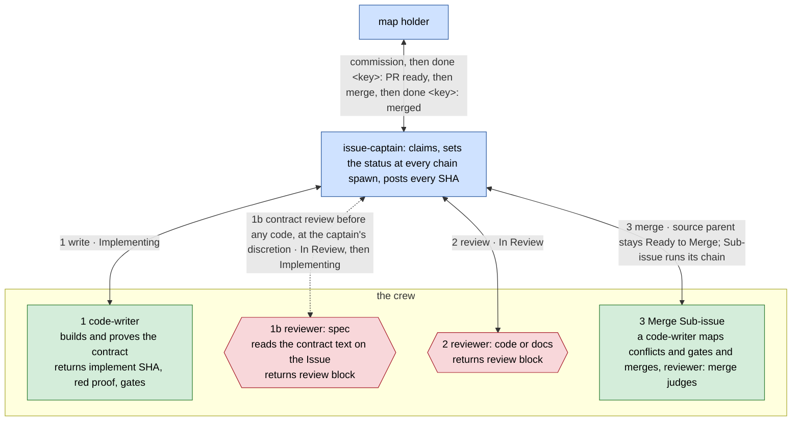
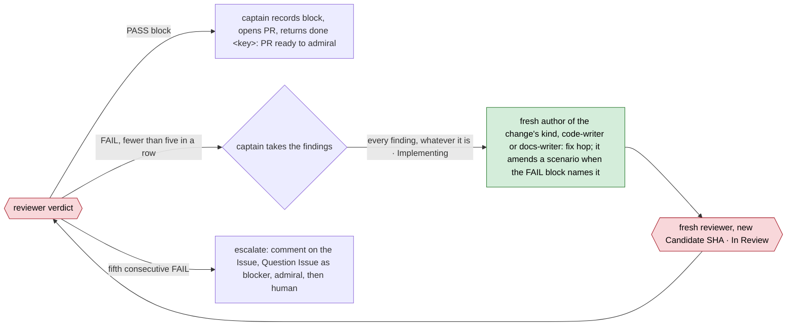
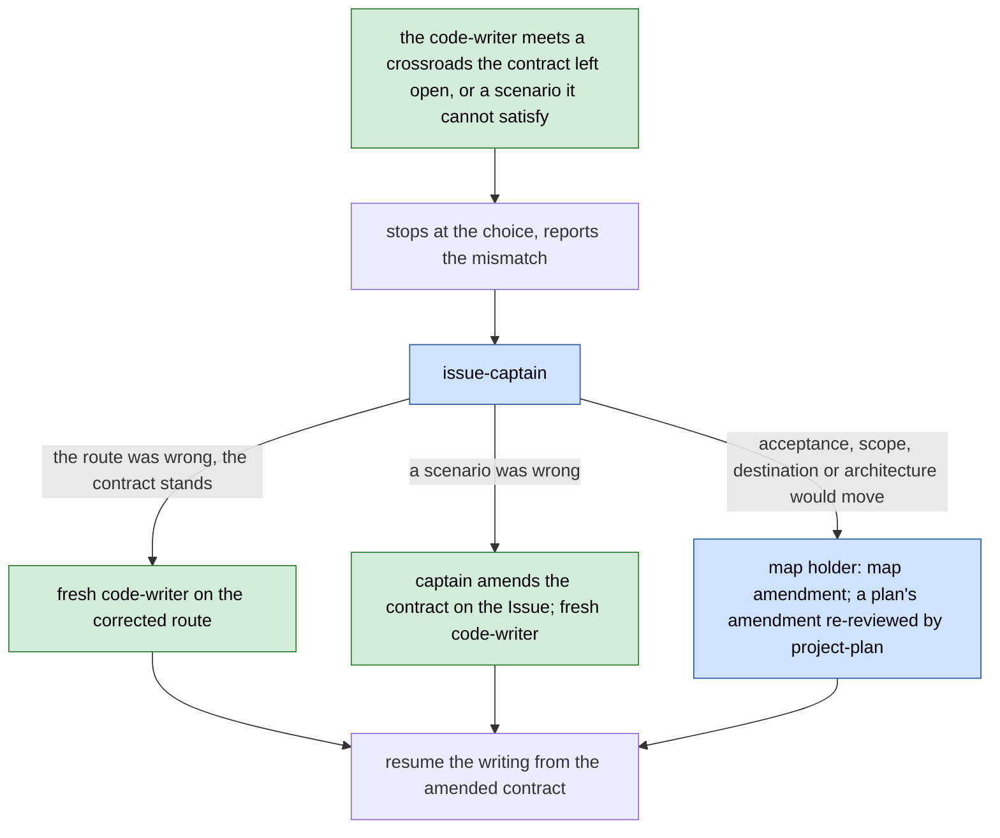
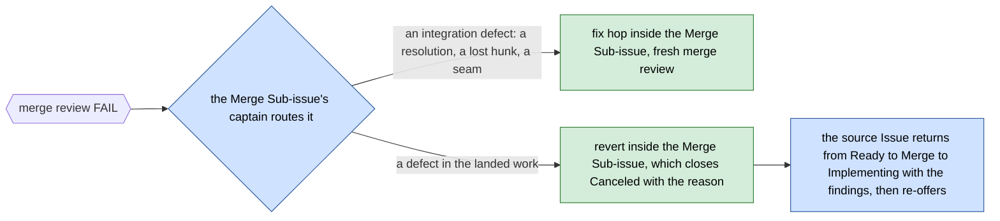
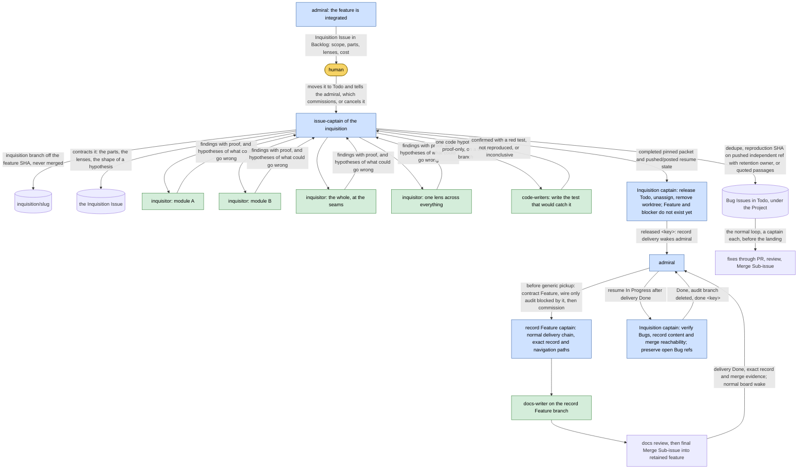
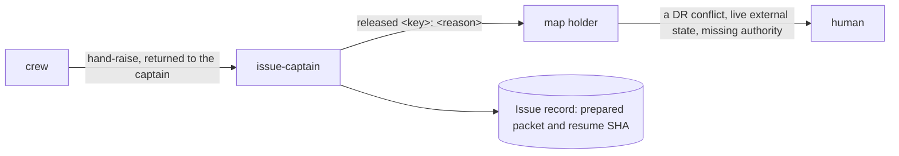

# Control Flow

Every handoff in the dydo 3 operating model, drawn from [DR 045](../project/decisions/045-flow-map-hats-review-tiers-and-working-tree-contract.md),
[DR 046](../project/decisions/046-executable-specifications-specifier-and-commit-addressed-hops.md),
[DR 047](../project/decisions/047-supersymmetry-hop-statuses-merge-issues-and-the-release-protocol.md),
[DR 050](../project/decisions/050-officers-crew-and-skills-hats-retired.md),
[DR 051](../project/decisions/051-captains-by-default-admiral-on-invocation.md)
and the [Linear Workspace Standard](../reference/linear-workspace-standard.md): who acts, on which
branch, what leaves them and through which channel, what the other side reads, and what happens when
the happy path breaks. It is the shared truth both sides of every contact must agree with. Section 7
shows a working day with three Projects in flight; section 8 lists what each skill must change to
match.

## How to read it

Node colours name the kind of actor; edge labels name the payload. The payload's channel and the
fields on both sides are in the edge table, section 5.

| Colour | Kind | Meaning |
|---|---|---|
| gold | human | the one person; opens every session that talks to him, acts at the gates |
| blue | officer | holds a Project, an Issue or the board and never switches; the map holder at its level |
| grey | session | a session without an officer role, loading a skill such as co-thinker |
| green | crew | spawned for one bounded job, returns to its spawner, never talks to the human |
| red | reviewer | a crew member whose return is the review block: one rubric, one binding verdict |

Channels: **L** a Linear field, comment or status · **G** a commit, branch or PR · **R** an agent's
return to its spawner, or a message to a returned one · **F** a file in the repository · **C** the
conversation with the human.

A Project's **map holder** is the human, in their own session, unless the human has invoked an
admiral. Where the flows below name the admiral, they draw an invoked one; without it, the human
takes that step, and nobody needs telling.

## 1. Roster

The actors: every officer and every crew role, plus the co-thinker skill a session without a role
loads to think with the human. The issue-captain is the default officer; an admiral exists only when
the human invokes one, as a right hand for throughput that never takes the frontline. An officer is
top-level when a session is opened with it; a captain is also spawned as an agent, so the human's
session or an invoked admiral can direct one per Issue.

| Role | Kind | Runs as | Invoked by | Works in | Does | Returns to |
|---|---|---|---|---|---|---|
| human | human | the terminal | — | `main`, where his own commits need no Issue, and any session | thinks, files Projects, holds a Project's map by default and charts it with `wayfinder`, approves plans, answers Questions, confirms inquisitions, clicks the landing one Project at a time and an atomic Issue's reviewed PR, walks through; tells an invoked admiral after each of his board moves, and takes the map back at any time | — |
| co-thinker | skill | any session without an officer role | any session with an unripe idea | no branch; DRs and glossary on the current branch | homework, grilling, domain-modeling, recommendation; a DR when the ADR test passes; an atomic Issue with its five fields, Type and Mode | a DR (F), a Project through `to-project` (L), an atomic Issue (L) |
| admiral | officer, optional | top-level session, explicit-only | the human, only when he wants a right hand for throughput, on a Project at any stage | `feature/<slug>` | holds the map until the human takes it back; wakes on a captain's return or the human's word, reads the Project and acts: charts it with `wayfinder`, writes a plan only for a cross-cutting architecture contract and owns its review, puts approval to the human, commissions the first captain to open the feature, commissions captains, wires the merge order and re-wires it when a later PR is ready first, sets priority on what waits on the human, runs its wayfinding with the human, proposes the inquisition, files the landing and the walkthrough, closes | the human in its own session (C); the board (L) |
| issue-captain | officer, the default, also agent | top-level for an atomic or HITL Issue; spawned by the human's session or an invoked admiral for an AFK one | the human's session, or an invoked admiral | `DYD-123-<slug>` in an isolated worktree; `inquisition/<slug>` for an inquisition | claims, takes an adjacent Issue only on the human's word, sets the status at every chain spawn, directs [code-writer] → [reviewer] on the parent or each lane and adds a spec review only on a risk its contract records, divides when the writer names lanes, sets `Ready to Merge` when the PR carries its PASS, runs its Merge Sub-issues or, on an atomic Issue, waits for the human's click, cleans up | the spawner: `done <key>` or `released <key>: <reason>` (R); everything else on the record (L) |
| chief-of-staff | officer | top-level session, explicit-only | the human | none | the bird's-eye view over the Projects in flight: the three lists, grilling open Questions, mediating collisions, sweeping stale state and orphans | the human (C); delivery staged on its Project for the map holder (L) |
| research | crew, delegates, web | agent | co-thinker, the map holder, issue-captain | reads | one fact a choice waits on, cited; sends scouts | the invoker: one-line answer, destination, unsettled points (R); report as Issue comment (L) or scratch file (F) |
| code-writer | crew | agent | issue-captain, on the parent first, then per lane | the Issue branch; a Merge Sub-issue; a proof branch off the audit SHA | one Issue's contract on the `implement` hop, test-driven by Type: a Bug red before its fix and red again with the fix reverted; a Feature's acceptance lines as named tests written with the code, proved to fail with the code stashed; the full suite and static gate of each changed stack once, HCRAP and cognitive complexity fixed in changed methods. Posts nothing before code unless it names lanes or an inexact contract. On a Merge: the merge commit and its resolutions. Proof-only: the test that would catch one hypothesis, committed as `<KEY> proof: <hypothesis>` | the captain: the `IMPLEMENTED` line with hop SHA, behaviour, red proof, gates run and blocker (R); for a hypothesis, `confirmed`, `not reproduced` or `inconclusive` |
| docs-writer | crew | agent | issue-captain, including the separate record Feature's captain for an inquisition | the delivery Issue branch | one documentation change with a witness per claim; the record Feature preserves the pinned inquisition packet | the delivery captain: ending SHA, exact record path/digest, files, witnesses, `dydo check` (R) |
| reviewer | crew, non-authoring | agent | the map holder, issue-captain | reads a pinned candidate | one rubric: code, docs, project-plan, spec, merge | the invoker: the review block (R), posted on the record and in the PR body (L, G) |
| scout | crew, non-authoring, web | agent | research | reads one source family | passages back, no conclusions | research (R) |
| inquisitor | crew, non-authoring | agent | an inquisition's issue-captain | reads the inquisition branch | one part or one lens swept, refuting its own catch; hypotheses of what could go wrong | the inquisition captain: findings with proof, hypotheses (R) |

For these three roles, non-authoring names the commission and method. It does not assert filesystem
enforcement by the host: a native sandbox setting is a request until a live host check proves the
restriction. Fresh commission, an isolated pinned candidate and independent review are the portable
floor.

## 2. Skills that are not actors

Methods run inside the caller's thread and leave nothing of their own; human commands run only when
the human types them.

Agent-invoked methods:

| Method | Reached by | When | Leaves behind |
|---|---|---|---|
| wayfinder | the map holder: the human's session, an invoked admiral, or an issue-captain | charting, writing the contracts one level down, working the map, clearing local fog | the map in the Project description; Issues and Sub-issues, wired |
| grilling | co-thinker, chief-of-staff, any Grilling Issue | a plan, decision or idea the human wants stress-tested, one round at a time | answers and reasoning recorded where the work lives |
| domain-modeling | co-thinker, wayfinder | a term keeps sliding, or a choice looks durable enough for a DR | `dydo/glossary.md` entries; a Decision Record |
| codebase-design | code-writer, reviewer | shaping a module or interface, choosing a seam, judging depth | vocabulary applied, nothing written |
| diagnosing-bugs | the code-writer reproducing a Bug, on the parent or its retained reproduce-or-identify Sub-issue | a defect without a red reproduction | a tight loop that goes red; the regression test; the cause on the Issue |
| prototype | the code-writer on a Prototype Issue | how it should look or behave is the open question | `prototype/<name>`, never merged; kept and linked from the Issue until the delivery Issue is `Done`, read by the delivery Issue's code-writer as the template for a fresh rewrite, never a base or a copy (DR 047 §5) |
| wizard | the captain on an Enablement Issue | steps only the human can perform: credentials, dashboards, cutovers | a bash wizard that walks him through them |
| writing-for-agents | anyone editing a skill or a document an agent reaches by pointer; reviewer(docs) | a prompt file is created, edited, or fires wrong | the edited file |
| self-improvement | any session; chief-of-staff routes recurring friction to it | the same friction or workaround returns a second time | one small, authorized, testable harness change |

Human commands:

| Command | The human types it when | Produces |
|---|---|---|
| to-project | a co-think is ripe and belongs in Linear | a Project in `Backlog`: title, summary, the intent as description, links to the DR, the glossary entries and the source FutureFeature when one exists; no Issues |
| to-issue | a plan, spec or conversation is ready to become Issues | pickable tracer-bullet Issues in `Todo`, each with one Type, a Mode where a captain holds the Type, and the five fields or its Type's own template, wired with native blocking relations |
| grill-me | a plan or idea of theirs should be pressed | answers and reasoning, recorded by the session in play |
| bro | an agent's pitch did not land | the same thing said plainly, with the two glossaries in hand |
| handoff | the session is ending and another agent continues | a handoff document in the scratch directory |
| walkthrough | a Walkthrough Issue is open | the four-part tour: what changed, where to look, how to try it, what reviewers flagged |
| teach | the human wants to learn a topic in the workspace | a mission and its learning records |
| improve-codebase-architecture | the codebase's architecture should be examined | a grilled candidate with its report |

The explicit-only officers admiral and chief-of-staff are also typed by the human; they are actors and
stand in the roster.

## 3. The happy path

The model is supersymmetric: a captain's Issue is a Project one level down. The same Types, the same
statuses and the same chain hold at both levels; only the map holder changes.

Capability rides with the delegation, not with the role. On every edge below, the delegating role
picks the model — and the effort where the host exposes one — for the crew member it is about to spawn,
weighing what that one task is worth. Nothing dydo compiles makes the choice for it;
[Configuration](../reference/configuration.md) carries each host's resolution order and what its
telemetry can and cannot prove afterwards.

### 3a. One Project



### 3b. One Issue

The captain is the connector: every crew member is briefed by it and returns to it, and it flips the
Issue's status at each chain spawn. The default crew is two: one `code-writer`, then one fresh
reviewer. The dashed edge is the captain's discretion, bought with one short concrete risk reason.



### 3c. The captain divides its Issue, when the writer names lanes

The map already divided the destination into Issues. The captain's first act on its Issue is a
`code-writer` on the parent; before any code it sees whether the Issue holds separate work that can
run at the same time, and if so posts one comment naming the lanes and stops. One dish stays one Issue.

An example with nothing to explain: a dinner for eight on Saturday.


Charting settled the theme through one Grilling Issue with the human: healthy, no refined sugar, one
vegetarian, food on the table at 19:00. The admiral works that map: three courses cooked in parallel
by three captains, and the shopping, blocked by all three menus. The diagram follows one captain.

- **The dessert's captain divides.** Its code-writer finds, before any code, that brownie and ice
  cream are made separately and at the same time, so the captain opens two Sub-issues, each
  with its own branch, worktree and crew loop, and keeps the plating on the parent for when both are
  in. Each lane comes back through its own Merge Sub-issue, one at a time; the dish is reviewed
  once, as a whole.
- **The starter's captain does not.** Its code-writer names no lane: one dish, one crew loop on the parent.
  Dividing is the exception the work has to earn.
- **The sweetener is a Question.** Both Sub-issues need one, the recipes are silent, and the theme
  rules out sugar. The captain's discovery finds "no refined sugar" on the Grilling and no
  replacement, and research cannot settle a matter of taste, so the captain files a Question
  Sub-issue under the dessert Issue in `Todo`, wired to block both lanes, priority `Medium` since
  two lanes wait. When the human answers, both resume. Had the question been which sweeteners the whole dinner allows, it would have gone to
  the admiral as a Project-level Question, because its answer reaches the other courses.

The rules the captain applies:

| Decision | Rule |
|---|---|
| Lanes first | the parent's code-writer goes first; before any code it names the lanes in one comment, or posts nothing |
| Lane or parent | separate work that can run at the same time becomes a lane; ordinary sequential work, the joining step, the parent's scenarios, the one review and the PR stay on the parent |
| What a lane carries | its parent's Type and Mode, a bounded outcome, a disjoint owned-path subset, exact gates, a child-key branch off the parent branch, an isolated worktree, its own status and evidence, its own [code-writer] → [reviewer] loop |
| What proves a lane | its gates; the parent's scenarios prove the joined result |
| Merges are Sub-issues | each lane into the parent, in order, then the parent into the feature: one Merge Sub-issue per merge, with its own merge review; never batched. An atomic Issue's own merge into main has none: the human clicks its reviewed PR |
| Depth | one level: a lane that needs splitting is replaced by sibling lanes; the Bug Type-map exception in §6.11, Merge and map-holder-held Sub-issues are the other children |
| Local fog | a Question that touches only this Issue is a Sub-issue here, in `Todo`; one whose answer reaches other Issues goes to the Project's map holder |

Step by step, with the Linear status each step leaves behind:

1. **Think.** The human brings an idea; the co-thinker does the homework, grills, fixes the words,
   recommends. Output: a DR when the ADR test passes, or ripe intent.
2. **File.** The human types `to-project`: a Linear Project in `Backlog` with the intent, its links
   and its answers. An atomic Issue is filed by the co-thinker with its five fields, one Type and one Mode, in `Todo`.
3. **Chart.** The map holder reads the Project, sets it `Planning`, and charts it with `wayfinder`:
   the map in the Project description, the first pickable Issues in `Todo`, which the human can
   write with `to-issue`, and the Project-level Questions in `Todo`, wired, with priority by the
   standard's guide. The Project and its Issues are the plan. Only a cross-cutting architecture
   contract earns a repository plan: the map holder commits it on `main` and loops a fresh
   `reviewer(project-plan)` to PASS, two rounds at most; a second FAIL goes to the human with the
   findings as the choice.
4. **Approve.** The human approves the charted route, in an invoked admiral's session when one holds
   the map; a reviewed plan's status becomes `reviewed`, and the Project `Planned`.
5. **Open.** The map holder commissions the first Issue Captain to open `feature/<slug>` from the
   approved `main` SHA before claiming its Issue. The map holder keeps the map in the Project description, gives every Issue its base branch and every Issue that merges its final Merge Sub-issue, wired in plan order, and sets the
   Project `In Progress`. Issues in
   `Todo` with no open blocker are pickable.
6. **Claim.** The map holder commissions a captain per pickable AFK Issue; a HITL Issue waits for
   the human to open its captain session. Assignment is the claim; branch, base SHA and worktree path go
   on the Issue before the first edit.
7. **Write.** The captain spawns one `code-writer` and sets `Implementing`. The captain's contract
   says whether the Issue carries Gherkin. The writer posts nothing before code unless the work
   splits into lanes or the contract is inexact; it builds test-driven by Type and ends on the
   `implement` commit whose SHA is posted. A captain that wants the contract judged before the code
   records the one risk in the contract and buys a fresh `reviewer(spec)` on that text, with the
   Issue `In Review` while it runs.
8. **Shape.** Only when the writer names lanes: the captain writes the lane contracts and opens lane
   Sub-issues in `Todo`, each with its own branch and worktree off the parent branch, plus one Merge
   Sub-issue per lane, wired in order; the parent sits `In Progress` while its lanes run. Section 3c.
9. **Prove red.** The writer's `IMPLEMENTED` return carries its red proof: a Bug's reproduction
   failing with the fix reverted, a Feature's tests failing with the code stashed.
10. **Review.** `In Review`; a fresh reviewer with one rubric returns the standard's one-line
    block. PASS binds that candidate under that contract. FAIL returns the record to
    `Implementing`, whatever it found.
11. **Offer.** The captain pushes the branch, opens the PR into the feature branch with the block in
    its body, sets `Ready to Merge`, and returns `done <key>: PR ready`.
12. **Merge.** When the Merge Sub-issue's blocker clears, the previous Issue's merge, the admiral
    resumes the captain with one word; when the next PR in plan order is not ready and a ready one
    does not depend on it, the admiral re-wires the order first. Its code-writer merges with `--no-ff`, a
    resolution that refactored leaving its code no worse than either side, before a fresh `reviewer(merge)` judges the integrated feature; PASS sets the Sub-issue and the primary `Done`.
    The captain cleans up and returns `done <key>: merged`. PR by PR, in plan order, never batched.
13. **Inquisition (rare).** The admiral files an Inquisition Issue with scope and cost in `Backlog`;
    the human confirms by moving it to `Todo` and telling the admiral; a captain runs it and files
    Bugs, which land through the normal loop before the landing. Section 6.6.
14. **Land.** The admiral files the landing Merge Issue; its captain directs a code-writer to merge `main` into
    the feature, a resolution that refactored leaving its code no worse than either side, verifies combined gates, and obtains the merge review that proves the plan's acceptance criteria, opens
    the PR into `main`, sets `Ready to Merge`, and prepares the walkthrough. The human clicks, one
    Project at a time; the PR lands as a merge commit.
15. **Walk through.** The admiral commissions the landing Captain to clean up after the human
    lands, opens the Walkthrough Issue and asks the human to invoke `walkthrough` in the same
    session before facilitating it. Findings become Issues; the admiral commissions the first fix
    Captain to re-cut the feature from `main` under the same name. Nothing found sets the Project
    `Completed`, with the landing Captain's artifact cleanup confirmed.

## 4. States

A delivery Issue's status is the only delivery status, and Linear owns it: ten statuses in the
standard's order, which Linear draws as progress. The captain alone sets it, flipping at every chain
spawn. An open native blocker makes an Issue blocked in any status; there is no `Blocked` status
and no `Waiting for Human`; `Planning` remains a Project status only.

```mermaid
stateDiagram-v2
  state "FutureFeature" as Future
  state "Todo" as Todo
  state "In Progress" as InProgress
  state "Implementing" as Implementing
  state "In Review" as InReview
  state "Ready to Merge" as Ready
  state "Done" as Done
  [*] --> Future: no Type yet
  Future --> Backlog: promoted with a Type
  [*] --> Backlog: retained with a Type
  Backlog --> Todo: the human schedules it, one Type, one Mode
  Backlog --> Canceled: declined
  [*] --> Todo: a map holder, co-thinker or to-issue creates it contracted
  Todo --> Implementing: captain spawns the author
  Implementing --> InProgress: the writer named lanes
  InProgress --> InReview: lanes merged, review of the whole
  Implementing --> InReview: implement hop posted
  Todo --> InReview: a spec review of the contract, before any code
  InReview --> Implementing: FAIL, whatever it found; or a spec review's verdict
  InReview --> Ready: PR ready with its PASS
  Ready --> Done: its Merge Sub-issue PASS; for an atomic Issue, the human's click
  Ready --> Implementing: merge review FAIL, reverted
  InReview --> Done: a Merge Sub-issue's own review PASS
  Implementing --> Todo: released
  InReview --> Todo: released
  Ready --> Todo: released
  InProgress --> Todo: released
  Future --> Todo: promoted and contracted
  InReview --> Canceled: a Merge Sub-issue reverted
  Todo --> Canceled
  Implementing --> Canceled
  Todo --> Duplicate
```

Who sets what: the captain sets every status of its Issue and Sub-issues; the Project's map holder
sets Project statuses and its own map-holder-held Issues'. A `Question` runs `Todo` → `Done` and `Todo` on it is
the human's turn; `Research`, `Grilling` and `Walkthrough` run `Todo` → `In Progress` → `Done`. A
captain-held Issue normally runs `Todo` → `Implementing` → `In Review` → `Ready to Merge` → `Done`,
with `In Progress` while its lanes run; a spec review the captain buys shows `In Review` before
`Implementing`. A Merge Sub-issue runs `Todo` → `Implementing` → `In Review` →
`Done` and never waits to be merged: one code-writer maps the conflicts and merges, a resolution
that refactored leaving its code no worse than either side. An atomic Issue has no Merge Sub-issue:
it waits in `Ready to Merge` for the human's click. An Inquisition
Issue runs `Backlog` → `Todo`, the human's confirmation → `In Progress`, the captain writes the
contract, then the sweep and proofs → released `Todo` → resumed `In Progress` → `Done`. It is
released while its separate record Feature runs the normal docs delivery chain, and resumed for
retention verification. A Merge Sub-issue
whose review fails on the landed work is reverted and closes `Canceled` with the reason.

## 5. Edges: the contract table

One row per contact. A sender's return must carry every field the receiver's Must-Reads consume;
a field read that nobody returns, or returned that nobody reads, is a finding.

| # | Edge | Channel | Sender returns or writes | Receiver reads | Status set |
|---|---|---|---|---|---|
| 1 | human → co-thinker | C | the idea | about, architecture, glossary, linear-workspace-standard | — |
| 2 | co-thinker → repository | F | a Decision Record; a glossary entry | — | — |
| 3 | human → `to-project` → Linear | C, L | the Project: title, summary, intent, decisions taken, out of scope, links to the DR, glossary entries, source FutureFeature | — | Project `Backlog` |
| 4 | co-thinker → Linear (atomic Issue) | L | an Issue with one Type, one Mode, outcome, owned paths, blockers, exact gates, base branch | — | `Todo` |
| 5 | human → admiral | C | the Project, at any stage | the Project, its plan at the governing commit when one exists, every Issue contract, working-tree contract | — |
| 6 | map holder → Linear (chart) | L | through `wayfinder`: the map in the Project description; first Issues with one Type, a Mode where a captain holds the Type, the five fields or their Type's own template, and native blocking edges; Project-level Questions naming waiters, with priority | the Project, governing DRs, about, architecture, dydo-glossary, linear-workspace-standard | Project `Planning`; first Issues and Questions `Todo` |
| 7 | map holder → repository, only for a cross-cutting architecture contract | F | the plan commit on `main` | — | — |
| 8 | map holder → reviewer(project-plan) | R (spawn) | the plan path at its commit | the plan, the project-plan rubric, cited DRs and paths | — |
| 9 | reviewer(project-plan) → map holder, Linear | R, L | the review block, as a Project update | — | — |
| 10 | invoked admiral → human | C | the charted route and any passing plan, for approval; after two FAILs, the findings as the choice | — | any plan `reviewed`; Project `Planned` |
| 11 | admiral → first Issue Captain, Linear | R, L | commission to open `feature/<slug>` from the approved main SHA before claim; the map in the Project description; base branch and blockers on every Issue, priority on every HITL one; the final Merge Sub-issue of every captain-held Issue that merges, created under it and blocked by the previous one in plan order | — | Project `In Progress` |
| 12 | admiral → issue-captain (AFK) | R (spawn), L | the Issue key; assignment | the Issue's five fields, the plan at its governing commit, working-tree contract | — |
| 13 | human → issue-captain (HITL, atomic, or any Issue without an invoked admiral) | C, L | the Issue key; assignment | the same | — |
| 13b | issue-captain (top-level) → human, admiral | C, L | `done <key>` or `released <key>: <reason>` in its own session; the human tells the admiral | the record | — |
| 14 | issue-captain → Issue | L, G | branch, base SHA, worktree path | — | — |
| 15 | issue-captain → code-writer | R (spawn) | the record to write, its kind | the owning Issue, and on a fix hop the FAIL block that sent it; the governing Project plan at its linked commit and the Decision Records it names; coding-standards | `Implementing` |
| 16 | code-writer → issue-captain | R, L, G | before code, only when needed: one comment naming the lanes or the inexact contract line; after: the `IMPLEMENTED` line with implement SHA, behaviour, red proof, the suites and static gates run with exits, blocker | — | — |
| 17 | issue-captain → Sub-issues | L, G | lane Sub-issues with the parent's Type and Mode, disjoint paths and branches, or retained Bug stages with native ordering and serial path transfer; one Merge Sub-issue per actual integration; a Question Sub-issue for local fog | — | lanes `Todo`; parent `In Progress` |
| 18 | issue-captain → reviewer(spec), optional, for one risk the contract records, before the code | R (spawn) | the record carrying the captain's contract | that text on the Issue, the five fields, base SHA, branch, worktree, owned paths | `In Review` → `Implementing` |
| 19 | issue-captain → code-writer, or docs-writer for a documentation change (fix hop) | R (spawn) | the Issue, the candidate, the review block that sent it | the Issue, the block, the plan, standards | `Implementing`, whatever the FAIL found |
| 20 | code-writer or docs-writer (fix hop) → issue-captain | R, G | Issue key, fix SHA, each finding with what closed it, gates rerun | — | — |
| 21 | delivery issue-captain → docs-writer | R (spawn) | the docs Issue and linked plan; for a record Feature, its exact owned record/navigation paths and the Inquisition's pinned packet | the delivery Issue, packet, about, writing-docs and working-tree retention contract | record Feature or other docs Issue `Implementing` |
| 22 | docs-writer → issue-captain | R | ending commit SHA, files changed, what each says and why, witnesses, `dydo check` and gate results | — | — |
| 23 | issue-captain → reviewer(code \| docs) | R (spawn) | rubric name, `Contract: <KEY> description as of <Linear updatedAt>`, Candidate SHA, Base SHA, the writer's `IMPLEMENTED` line | the contract as of that `updatedAt` with outcome, scenarios, owned paths, gates; the rubric; the hops; the `IMPLEMENTED` line, rerun only on a stated doubt | `In Review` |
| 24 | reviewer → issue-captain, record, PR | R, L, G | the review block in the standard's one-line `PASS` or `FAIL` form; observations after it | — | `Implementing` on FAIL, whatever it found |
| 25 | issue-captain → Merge Sub-issue (one per lane) | L, R (spawn), G | the lane branch at its PASS SHA; a code-writer maps conflicts and gates, merges it into the parent, a resolution that refactored leaving its code no worse than either side, then a fresh `reviewer(merge)` over the parent | the Merge template's fields: source, target, combined gates | lane `Ready to Merge` at its PASS, `Done` when merged; after the last, parent `In Review` for the review of the whole |
| 26 | issue-captain → admiral | G, L, R | the PR into the feature branch with the block; `done <key>: PR ready` | the record | parent `Ready to Merge` |
| 27 | admiral → issue-captain | R (message) | `merge`, when the Merge Sub-issue's blocker clears, after re-wiring the order when a later PR was ready first; or a fresh commission from the record | the Merge Sub-issue, the PR, the feature SHA | — |
| 28 | issue-captain → Merge Sub-issue (into the feature) | R (spawn), G | a code-writer maps the conflicts and combined gates, merges `--no-ff` and resolves, a resolution that refactored leaving its code no worse than either side, then a fresh `reviewer(merge)` over the integrated feature | the merge commit, both parents, the landed Issue's gates, the plan at its governing commit | Sub-issue and primary `Done` on PASS |
| 29 | reviewer(merge) → issue-captain, Merge Sub-issue | R, L | the review block naming the merge commit and the gates rerun | — | — |
| 30 | issue-captain → admiral | R, L | `done <key>: merged`; worktrees and branches cleaned | — | — |
| 31 | map holder → Linear, repository | L, F | new, split, dropped or resequenced Issues and Project-level map-holder-held Issues; dated amendments committed to a repository plan, where one exists | a fresh `reviewer(project-plan)` reads an amendment that moves destination, scope, acceptance or architecture | — |
| 32 | admiral → Linear (inquisition proposal) | L | an Inquisition Issue under the Project: scope, the parts and lenses, the cost, the feature SHA | — | `Backlog` |
| 33 | human → Linear, admiral (inquisition confirmation) | L, C | the Inquisition Issue moved to `Todo`, or `Canceled` with the reason; the human tells the admiral | — | `Todo` |
| 34 | admiral → issue-captain (inquisition) | R (spawn), L | the Inquisition Issue key; assignment | the Issue, the plan at its governing commit, the integrated feature SHA, working-tree contract | — |
| 35 | inquisition captain → Git | G | `inquisition/<slug>` off the feature SHA, never merged; a child branch per proof | — | — |
| 36 | inquisition captain → inquisitors | R (spawn) | one part or one lens each, the scope, the plan, the Issue review evidence | the assignment with its evidence, about, architecture, coding-standards | `In Progress` |
| 37 | inquisitor → inquisition captain | R | findings with `file:line`, severity and proof; hypotheses of what could go wrong, each with the test that would decide it, or, in prose, docs or a prompt file, both contradicting passages quoted at `file:line`, which are its reproduction with no test and no proof branch | — | — |
| 38 | inquisition captain → code-writer (proof-only) | R (spawn) | one code hypothesis, its child branch off the inquisition branch, source read-only | the hypothesis as the Issue, coding-standards | — |
| 39 | code-writer (proof-only) → inquisition captain | R, G | `confirmed` with the red test at its SHA, `not reproduced`, or `inconclusive`, with the observation that decided it | — | — |
| 40 | inquisition captain → Linear, Git, Bug captain | L, G | one Bug per confirmed problem under the Project, feature base, reproduction SHA and pushed independent named ref (a prose Bug: its quoted passages), Inquisition link; retention ownership transfers only on recorded Bug-captain adoption | Bug captain reads the reproduction as normal-chain input and records cleanup responsibility | Bugs `Todo` |
| 41 | inquisition captain → admiral, Linear | R, L, G | completed pinned packet: feature SHA, scope, parts/lenses, findings, hypotheses/verdicts and Bugs; pushed/posted resume state; `released <key>: record delivery` before record Feature/blocker exists | this return wakes admiral to read packet and working-tree retention contract | Inquisition released `Todo`, unassigned, worktree removed; no not-yet-created blocker required |
| 41a | admiral → record Feature captain, Linear | R (spawn), L | on row41 wake, first contract separate primary Feature/AFK on retained feature with exact record and authored navigation paths, packet and gates; wire only Inquisition blocked by Feature before generic pickup, then commission record captain | record captain reads contract/packet and directs docs-writer → docs review → final Merge Sub-issue | record Feature `Todo`, pickable from packet; audit is not recommissioned from temporary Todo gap |
| 41b | record Feature captain → admiral, Inquisition Issue | R, L, G | `done <key>: merged`; exact record path/blob or digest, delivery merge SHA and retained feature ref, review/gates on delivery records | normal board loop reads delivery `Done` and resumes released Inquisition captain | record Feature `Done`; Inquisition resumes `In Progress` |
| 42 | inquisition captain → admiral, Linear | R, L | `done <key>` after verifying Bugs, exact record content and delivery merge ancestry/reachability on retained feature; verification on Issue, audit branch deleted, open Bug proof refs retained with named owners | admiral reads durable completion evidence | Inquisition `Done` |
| 43 | admiral → Linear (landing) | L | the landing Merge Issue: `main` into the feature, gates, merge review with acceptance proof, the PR into `main`, the walkthrough prepared | — | `Todo`, blocked by unresolved prerequisites for this landing: delivery, confirmed Inquisition/record and required fixes; exclude self and later/deferred work |
| 44 | landing captain → Git, admiral | G, R | the PR into `main` with its PASS block; `done <key>: PR ready` | — | landing `Ready to Merge` |
| 45 | admiral → human → Git | C, G | the PR to click and the walkthrough that follows; the feature merged into `main` as a merge commit, one Project at a time; the human tells the admiral, which resumes the landing captain to close and clean up the merged feature: `done <key>: merged` | — | landing `Done`, set by its captain |
| 46 | admiral → Walkthrough Issue, human | L, C | the Issue; request for the human to invoke `walkthrough` in this session, then the four-part tour; commission first fix Captain to re-cut the feature if findings reopen the lap | — | `In Progress` → `Done`; findings as Issues; Project `Completed` when none |
| 47 | crew → issue-captain (hand-raise) | R | the question, what was searched, why it blocks, facts or options found | — | — |
| 48 | issue-captain → research | R (spawn) | the question and where the findings land | the question and destination, about, architecture | — |
| 49 | research → issue-captain | R, L or F | one-line answer, destination, unsettled points; the report as an Issue comment or scratch file | — | Research Issue `Done` by the map holder |
| 50 | issue-captain → Linear (local fog) | L | a Question Sub-issue under the delivery parent, wired as blocker, with its priority by the standard's guide; the record is the whole report | — | Question `Todo` |
| 51 | issue-captain → admiral (Project-level fog, or any release) | R, L, G | `released <key>: <reason>`; prepared packet and resume SHA on the record, branch pushed, worktree removed, parent unassigned | — | parent `Todo`, blocker wired |
| 52 | admiral → Linear, human | L | a Project-level Question Issue with homework, options, recommendation, wired to every waiter, with its priority by the standard's guide | — | `Todo` |
| 53 | human → Linear, repository, admiral | L, F, C | the answer on the Issue; a DR when it qualifies; the human tells the admiral | — | Question `Done` |
| 54 | admiral (every wake: a return or the human's word) → Linear | L, R | commissions every pickable Issue, blocker-cleared ones included; re-wires the merge order when a later PR is ready first; resumes every Merge Sub-issue whose turn came; re-sets priority on what waits on the human | the board | — |
| 55 | human → chief-of-staff | C | a request for triage | the board: open Questions, the gates, Projects in flight; working-tree contract | — |
| 56 | chief-of-staff → human, Linear | C, L | three lists with recommendations; mechanical fixes; delivery staged on its Project for the admiral | — | — |
| 57 | human → issue-captain (takeover) | C via the admiral, or the sub-agent's transcript | `release`: the captain releases as in row 51; the human opens a top-level captain on the Issue | the record's resume point | parent `Todo` |

## 6. Exceptions

### 6.1 A crew member raises a hand

Fog inside an Issue. The rule is fog → discovery → question Issue, and the Question is the last rung.

```mermaid
sequenceDiagram
  participant W as crew
  participant C as issue-captain
  participant R as research
  participant A as admiral
  participant B as Linear
  participant H as human
  W->>C: hand-raise: question, sources searched, why it blocks, options found
  C->>C: bounded discovery: DRs, plan, Issue links, glossary, code, tests
  alt the sources settle it
    C->>W: answer recorded on the Issue, resume
  else a fact outside the tree settles it
    C->>R: the question and the destination
    R-->>C: one-line answer, report on the Issue
    C->>W: resume
  else human judgment, inside this Issue's outcome and the Project destination
    C->>B: Question Sub-issue under the delivery parent, Todo, wired as blocker, with its priority
    C->>A: released &lt;key&gt;: &lt;reason&gt;
    Note over C,B: packet and resume SHA on the record; parent Todo, Question wired as blocker
    B-->>H: the chief-of-staff or the board surfaces the Question in Todo
    H->>B: answer on the Issue, Question Done, blocker cleared
    H->>A: tells the admiral
    A->>C: next wake, the parent is pickable, re-commission from the record
  else the answer could change other Issues, a shared contract or the destination
    C->>A: released &lt;key&gt;: &lt;reason&gt;
    Note over C,B: prepared packet and resume SHA on the record
    A->>B: Project-level Question Issue in Todo, wired to every waiter, with its priority
    B-->>H: surfaced
    H->>B: answer, a DR when it qualifies
    H->>A: tells the admiral
    A->>A: wayfind: amend the map, re-review when destination, scope, acceptance or architecture moved
    A->>C: re-commission the Issue
  end
```

The contract: the crew member never fills a gap with an assumption and never creates an Issue; the captain
owns discovery and the local map; the scope rule in the workspace standard decides local Sub-issue
versus Project-level packet; the Project's map holder alone creates Project-level Questions; the human answers on
the Issue, never in a chat that evaporates; the chief-of-staff surfaces open Questions when the human
asks it to, it is never sent anything.

### 6.2 Review FAIL



The contract: FAIL is binding; every FAIL returns the record to `Implementing`, whatever it found,
and a wrong or missing scenario is amended by the next fix hop; every
correction is its own commit and the re-review pins the new SHA; a note is a finding; the fifth consecutive FAIL
in one review loop stops the loop rather than softening the verdict. A contract amendment that changes
acceptance is an amendment of the contract and, under a Project, goes to the admiral as a plan
amendment.

### 6.3 The contract or the route is disproved mid-implementation



The contract: the scenario set is the captain's, so the writer wires each scenario and changes one
only when asked; the change is written on the Issue; a contract change above the Issue's authority
climbs the ladder before work resumes.

### 6.4 Plan amendment

The approved route fixes the destination, not every turn. The map holder creates, splits, drops and
resequences Issues and records discoveries; where a repository plan exists, it commits dated
`## Amendment — <date>` sections to it. Route-only amendments need no review. An amendment
that changes destination, scope, acceptance criteria or governing architecture goes back through
`reviewer(project-plan)`, when a plan exists, and human approval before the affected Issues are
commissioned. The review
loop is capped at two rounds at any time; the second FAIL is the human's choice.

### 6.5 Merge review FAIL

The merge is an Issue, so the FAIL has an owner.



Revert keeps the feature branch always green and the Issue's own loop intact. Once a later merge
already depends on the failed one, a fix Issue follows it instead of a revert. An atomic Issue has
no Merge Sub-issue, so a defect found on `main` after its merge is a Bug.

### 6.6 The inquisition

An Issue like any other, with its own captain, run once the feature is integrated and the human has
confirmed the spend. It does what a review does, at two scales a single review cannot reach: many
read-only eyes on the parts and on the whole, and hypotheses of what could go wrong proved: one in
code by a proof-only test, one in prose, docs or a prompt file by its quoted passages. It does not
gate; it files.



The contract: the admiral proposes by filing the Inquisition Issue in `Backlog` with the parts and
lenses it wants swept and the cost; the human confirms by moving it to `Todo`, which is the gate DR
045 reserves; the captain claims it like any Issue and works on `inquisition/<slug>`, cut from the
integrated feature SHA and deleted when the Issue is `Done`, so nothing on it can leak into the
product; inquisitors are read-only and refute their own catches, and their second product is the
hypothesis list; each hypothesis in code goes to a proof-only code-writer whose only output is a test,
red if the hypothesis holds, while one in prose, docs or a prompt file is proved by both contradicting
passages quoted at `file:line` on the feature SHA, with no test and no proof branch; a confirmed
hypothesis is no longer a hypothesis and joins the findings; the captain deduplicates and files one
Bug per problem under the Project, with the feature as base branch and the red test's commit, or the
quoted passages, as reproduction, so each is picked up by a captain and fixed through the normal loop. The completed packet goes to the admiral, whose separate record Feature delivers
`dydo/project/inquisitions/` through its own captain, docs-writer, reviews and Merge Sub-issue.
The [working-tree contract](../guides/working-tree-contract.md#retaining-an-inquisitions-record-and-proofs)
owns the one-way blocker, release/resume, durable-content checks and independent Bug proof refs.
The Inquisition closes only after those checks; its return is `done <key>`. There is no PASS or FAIL:
Project acceptance is proved by
the landing's merge review, and the Bugs the inquisition filed are landed before the landing.

### 6.7 An atomic Issue

No Project, no admiral. The co-thinker reads the workspace standard and writes the Issue with its five fields, one Type
and one Mode in `Todo`; the human opens a
captain on it, or spawns one from any session, and it claims from `main`, runs the same crew and the same
reviewer, and opens the PR into `main` with its PASS block. There is no Merge Sub-issue (DR 047,
amended 2026-09-23): once CI is green the captain sets `Ready to Merge` and returns
`done <key>: PR ready`; the human clicks the merge; the captain then closes the Issue `Done`, cleans
up and returns `done <key>: merged`. Beyond that click, the human's only gate is the one the captain
chooses to raise. The human's own commits on main are outside the model and need no Issue.

### 6.8 Escalation and precedence



Agents settle operational conflicts themselves, highest first: the human's live instruction, a
Decision Record, the reviewed plan at its governing commit, the Issue contract, coding standards,
existing code. Beside that ladder stands the truth rule for live work: the Linear record is the
default truth and its latest word wins; an agent that finds a conflict raises it, and a live
instruction that overrides the record is written back to it. A crew member raises its hand by returning to its Issue Captain (row 47); the
captain's rungs are a comment on the Issue and, when blocked, a wired Question Issue in `Todo`;
never silent waiting. The code-writer's one pre-code comment naming lanes or an inexact contract is
its scoped exception, not a hand-raise.

### 6.9 A prototype

A Prototype Issue is held by a captain and run for the human: fast sketches that settle a visual or
behavioural choice, co-thinking in code. Its contract names the question and the variants; its
code-writer builds them on `prototype/<name>` in its own worktree; the human is the review, in the
session. The verdict goes on the Issue with the winning commit. The
branch is kept and linked from the Issue until the delivery Issue is `Done`; that Issue's code-writer
reads it as the template for a fresh rewrite, never as a base or a copy, and nothing on it is ever submitted or merged (DR 047 §5).

### 6.10 A release: blocked, taken over, or dead

One mechanism serves three cases.


On Claude Code a one-off steer needs no release: the human opens the captain's transcript from the
subagent panel and sends it a message there. Anything longer is a release and a top-level captain.
The steer is a Claude Code convenience; the floor on both hosts is the release.
[DYD-88 — Codex sub-agent lifecycle observations — 2026-09-14](https://linear.app/bodnar-balazs/document/dyd-88-codex-sub-agent-lifecycle-observations-2026-09-14-37f58f170af1) established returned-sub-agent resume,
while passive wake and human-origin steering remain unestablished on Codex.

### 6.11 A Bug

A Bug runs the same chain, mapped by its captain from the template's default. For a simple known
cause, collapse reproduce-or-identify and fix placeholders into parent hops and close unused
records `Canceled` with the reason. DR 047 §5 also permits retaining those ordered Bug Sub-issues:
fix is natively blocked by reproduction, and shared paths transfer only after reproduction closes
with its evidence recorded. Each stage has its own contract, chain, branch and worktree; every
actual integration has a Merge Sub-issue. This Type-map exception does not relax disjoint ownership
for parallel lanes; joining acceptance and final review stay on the parent. An elusive defect turns identification into hypotheses and proof tests,
as the inquisition does; a trivial one collapses to one record. The reproduction is a scenario when
the defect shows at the product's boundary, else a red test written through diagnosing-bugs; the
fix proves itself by reverting and watching that reproduction fail again. A Bug the inquisition filed arrives with its red
test at a commit, which the fixing code-writer adopts, or, from prose, with its quoted passages. Under a Project it lands like any Issue; outside one it
is atomic.

### 6.12 The second lap

The walkthrough finds something. The Project stays open: the findings become Issues, the feature
branch is re-cut from `main` under the same name, and the lap runs fixes → Merge Sub-issues → the
landing → another walkthrough, with an inquisition in between only when the human confirms one. The
Project is `Completed` when a walkthrough finds nothing.

## 7. A day with three Projects

The target the model is built for: the human's queue is never empty and never a wall. Every item on
it has its homework done, so the human's minutes go to judgment, taste and direction: an answer, a
reaction to a prototype, an approval, a landing, a walkthrough. Agents never wait on the human
without a `Question` in `Todo`, and the human never waits on agents: when the queue empties, the next
idea goes to a co-thinker. Priority on what waits on him says which comes first: the one that frees
the most AFK work.

This day the human has invoked three admirals for throughput: three top-level sessions in three terminals, each in its feature worktree; their
captains are sub-agents in Issue worktrees. The human's own terminal wears chief-of-staff to read the
queue, and co-thinker or a HITL Issue's captain, a Prototype's among them, to act on it.

A snapshot at 10:40:

| Project | Status | Session | In flight | Waits on the human |
|---|---|---|---|---|
| A: Reqnroll in DynaDocs | `In Progress` | admiral A | DYD-90 `Implementing`; DYD-91 `Todo`, blocked by DYD-90, whose outcome it builds on | nothing |
| B: Notion export | `In Progress` | admiral B | DYD-95 `In Review`; DYD-96 `Implementing`; DYD-97 Prototype, HITL, `Todo`, `High`: its verdict frees DYD-98 | a captain session on the prototype |
| C: Attention taxonomy | `Planning` | admiral C | the draft of its cross-cutting architecture plan, blocked by DYD-99 Question in `Todo`, `High`: the whole plan waits | an answer |


The chief-of-staff's three lists at that moment: *Answer needed*, DYD-99, `High`, a five-minute
answer; *Approval needed*, none; *Landing*, none. DYD-97, also `High`, waits on the human's captain
session rather than an answer. Then, in order:

1. **10:40.** The human answers DYD-99 on the Issue and tells admiral C; the blocker clears; admiral
   C finishes the plan and sends it to `reviewer(project-plan)`.
2. **10:45.** The human opens a captain session on DYD-97, the prototype: a UI question, two
   variants to react to in that session. While it runs, DYD-90's code-writer returns and its reviewer PASSes; its captain
   opens the PR, sets `Ready to Merge` and returns `done DYD-90: PR ready`; admiral A resumes it for the
   Merge Sub-issue, whose review PASSes; DYD-91's blocker clears and it gets a captain. DYD-95's
   reviewer FAILs on one finding; its captain routes it to a fresh code-writer and the Issue shows
   `Implementing`.
3. **11:15.** The prototype's verdict is on DYD-97 with the winning commit and the human tells
   admiral B, which graduates the answer into DYD-98, a delivery Issue. Project C's plan has a PASS
   and waits for approval: the next item on the queue.
4. **11:20.** The human reads the plan's destination and first Issues in admiral C's terminal and
   approves; the Project is `Planned`; admiral C commissions its first captain to open the feature
   from the approved main SHA before claiming its Issue.
5. **11:30.** The queue is empty. Admiral A has two captains running, admiral B one and a fresh
   review, admiral C one. The human takes the next raw idea to a co-thinker, or reads the walkthrough
   of what landed since morning.

## 8. Prompt-file propagation — DYD-90

The authored contacts now carry DR 047. DYD-90's specification pins the file boundary and proof;
its candidate receives independent docs review and root contact review before integration.
Completed rows below name the source, not a claim that generated runtime output has been refreshed.

| File | Disposition |
|---|---|
| ~~admiral~~ | Authored: optional, only when the human invokes it (DR 051); charts with `wayfinder` as map holder; board wakes, planning/review/human approval, captain commissions and merge ordering; no Git beyond its plan's commits; landing and walkthrough. |
| ~~issue-captain~~ | Authored: specify first, lanes/empty hops, statuses, four-field reviewer brief, two-step returns, release and Merge FAIL. |
| ~~project-planner~~ | Removed by DR 051: the map holder charts with `wayfinder`, and `to-issue` carries upstream tracer bullets and blockers. |
| ~~specifier, implementer, hardener~~ | Retired: the single `code-writer` absorbs all three (DYD-222); the `Specifying` and `Hardening` statuses retired on 2026-09-23. |
| ~~reviewer~~ | Authored: four-field brief, pinned block on work judged, same merge rubric at every level. |
| ~~docs-writer~~ | Authored: captain invocation, committed evidence and inquisition record. |
| ~~inquisitor~~ | Authored: read-only captain assignment, findings/hypotheses with proof seam; no workflow verify job. |
| ~~chief-of-staff~~ | Authored: Questions plus human gates, priority and released blockers; prototype retention follows delivery completion. |
| ~~co-thinker~~ | Authored: explicit to-project graduation, atomic five-field contract, FutureFeature status. |
| ~~wayfinder~~ | Authored: map holder at both levels, local/Project Question scope, Merge order. |
| ~~to-project, wizard~~ | Authored imports with pinned MIT provenance; wizard shell example shipped through Markdown resource. |
| compiler workflow emission | Retired by DR 049: the compiler is gone, so there is no workflow discovery, emission, or summary. Roles are native `SKILL.md` folders. |
| ~~types.json~~ | Inspected: document vocabulary already has inquisition and no workflow; Linear's ten Types are a separate standard. |
| dydo init | Deferred to DYD-86: native nesting depth and host setup proof. |
| ~~working-tree contract~~ | Authored/local twin: captain's Merge at each level, branch exceptions, release and merge-commit landing. |
| getting-started | Deferred to DYD-91: framework setup checklist and template registration. |
| ~~dydo.json~~ | Removed in source: no model or effort property remains; the delegating role chooses both at dispatch (DYD-134). |
| ~~work-model, task-lifecycle, dydo-glossary~~ | Authored/local prose: current flow, Types, release, Questions, inquisition and supersymmetry. |
| generated skills, agents, framework hashes and host reflection | Retired by DR 049: roles are native `SKILL.md` folders, edited directly; no compiler, hashes, or generated agent files remain. |

## Related

- [Work Model](./work-model.md) — the flow map, officers and crew, reviews and inquisition this map expands
- [Linear Issue Lifecycle](./task-lifecycle.md) — what an Issue carries and how it is claimed and merged
- [Working-Tree Contract](../guides/working-tree-contract.md) — branches, worktrees, hops, cleanup
- [Linear Workspace Standard](../reference/linear-workspace-standard.md) — statuses, Types, Mode, templates
- [dydo Glossary](../reference/dydo-glossary.md) — the locked vocabulary
- [DR 047](../project/decisions/047-supersymmetry-hop-statuses-merge-issues-and-the-release-protocol.md) — the decisions this map draws
