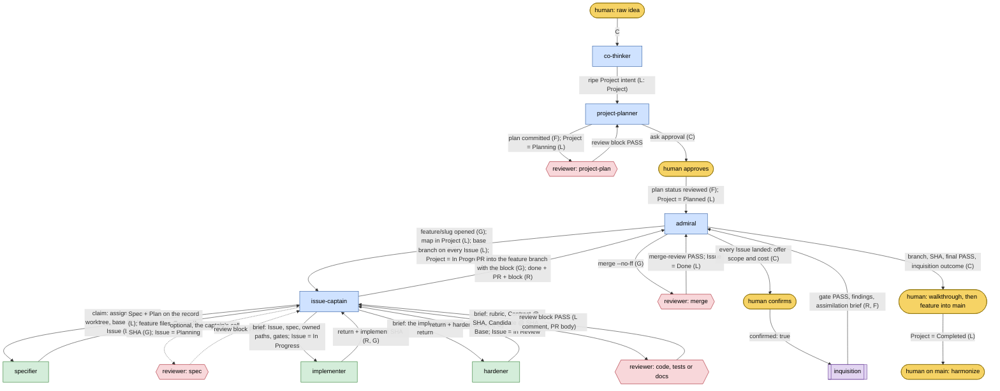
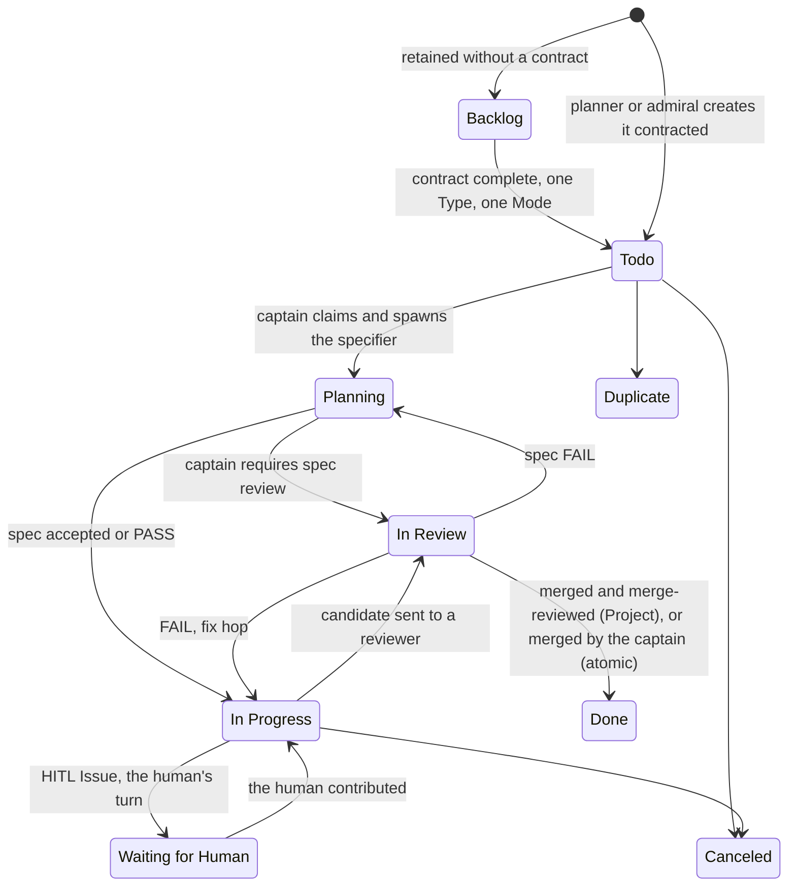
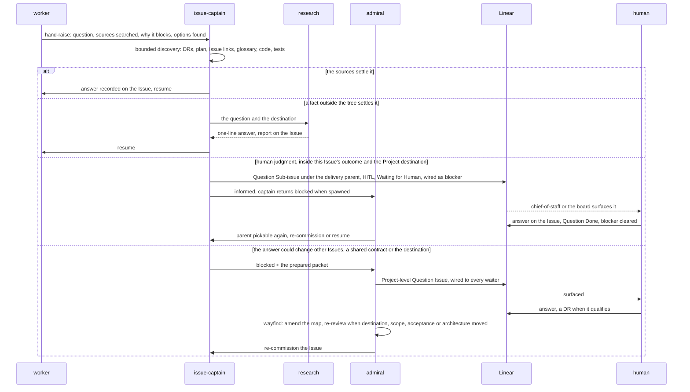
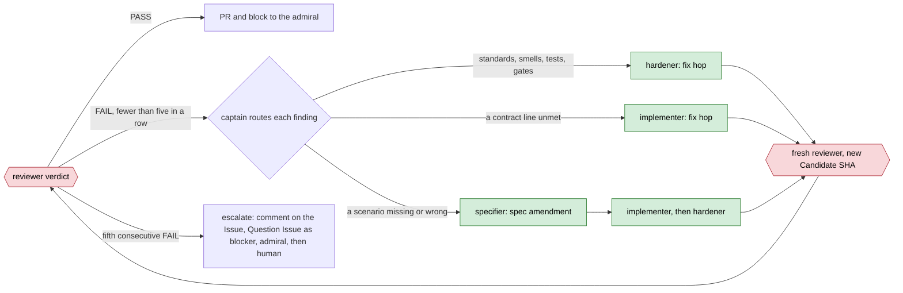
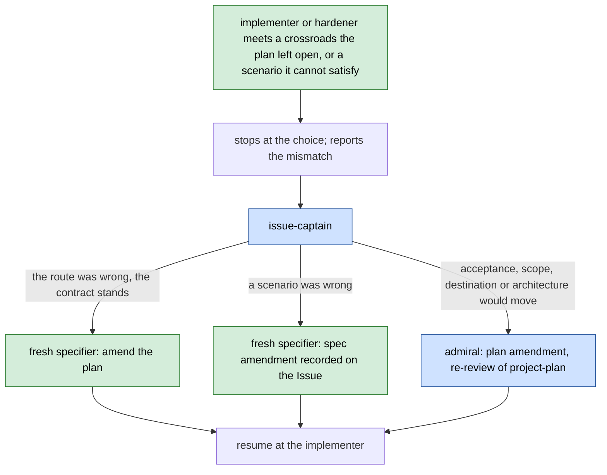
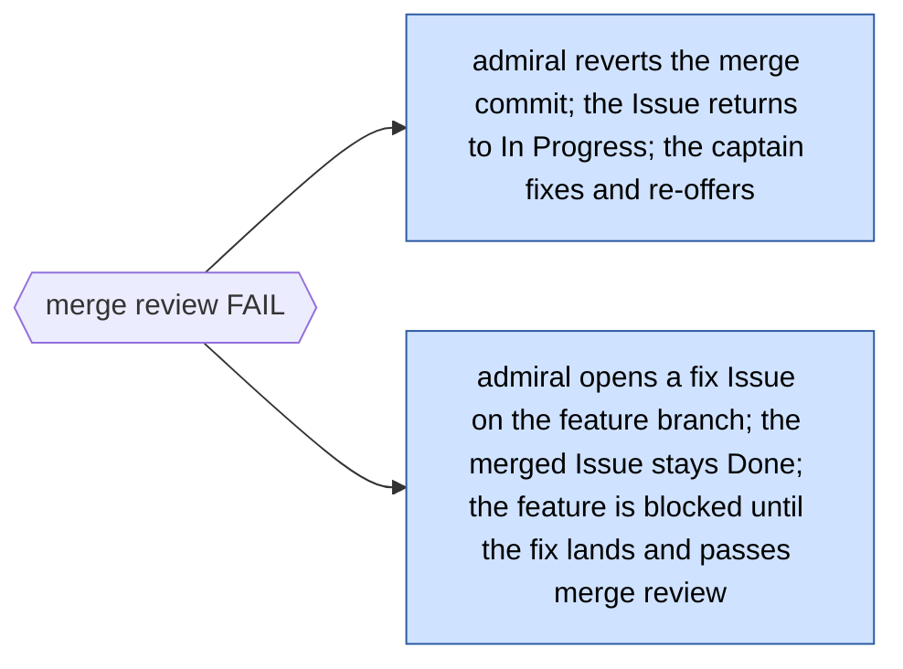
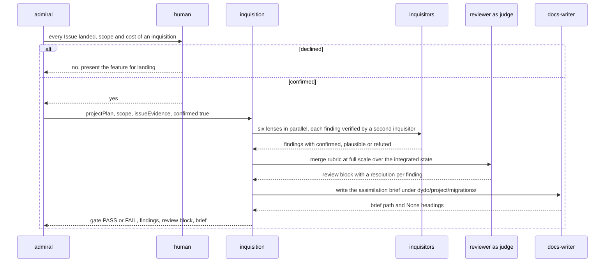
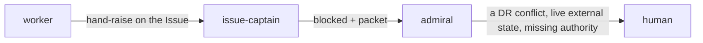

# Control Flow

Every handoff in the dydo 3 operating model, drawn from [DR 045](../project/decisions/045-flow-map-hats-review-tiers-and-working-tree-contract.md),
[DR 046](../project/decisions/046-executable-specifications-specifier-and-commit-addressed-hops.md),
the [Linear Workspace Standard](../reference/linear-workspace-standard.md) and the accepted skills:
who acts, on which branch, what leaves them and through which channel, what the other side reads,
and what happens when the happy path breaks. It is the shared truth both sides of every contact must
agree with. Section 6 lists where the skills disagree with it today.

## How to read it

Node colours name the kind of actor; edge labels name the payload and its channel.

| Colour | Kind | Meaning |
|---|---|---|
| gold | human | the one person; acts at the five gates and wears the explicit-only hats |
| blue | hat | what a session is doing now; a hat that also compiles as an agent can run as a sub-agent |
| green | worker | spawned for one bounded job, returns to its spawner, never delegates |
| red | reviewer | a worker whose return is the review block: one rubric, one binding verdict |
| purple | workflow | a host-executed script; the inquisition is the only one |

Channels: **L** a Linear field, comment or status · **G** a commit, branch or PR · **R** an agent's
return to its spawner · **F** a file in the repository · **C** the conversation with the human.

## 1. Roster

| Role | Kind | Runs as | Invoked by | Works in | Does | Returns to |
|---|---|---|---|---|---|---|
| human | human | the terminal | — | `main`, and any hat | thinks, approves plans, answers Questions, confirms inquisitions, lands features, harmonizes | — |
| co-thinker | hat | top-level session | any session with an unripe idea | no branch; DRs and glossary on the current branch | homework, grilling, domain-modeling, recommendation; a DR when the ADR test passes | a DR (F), a FutureFeature (L), a ripe Project (L) or atomic Issue (L) |
| project-planner | hat, also agent | top-level, or spawned by an admiral | co-thinker's ripe intent | the plan file in `dydo/project/plans/` | fixes the destination, first pickable Issues, bearings, blocking Questions; owns the project-plan review loop | the human for approval (C); the admiral with the passing commit and first Issues (R) |
| admiral | hat | top-level session, explicit-only | the human, on an approved Project | `feature/<slug>` | opens the feature, commissions captains, merges serially, merge-reviews, wayfinds, offers the inquisition, closes the Project | the human with branch, SHA, final PASS, inquisition outcome (C) |
| issue-captain | hat, also agent | top-level for an atomic Issue, or spawned by an admiral | the admiral, or the human | `DYD-123-<slug>` in an isolated worktree | claims, shapes lanes, directs [specifier] → [implementer] → [hardener] → [reviewer], integrates, opens the PR, cleans up | the admiral: `done` + PR + block, or `blocked` + record or packet (R) |
| chief-of-staff | hat | top-level session, explicit-only | the human | none | triages the board into three lists, grills open Questions, mediates collisions, sweeps stale state and orphans | the human (C); delivery staged for the admiral (L) |
| specifier | worker | agent | issue-captain, per parent or lane | the Issue branch | spec (scenarios and gates) and route; commits feature files as the `specify` hop | the captain: spec, plan, SHA, review recommendation (R) |
| implementer | worker | agent | issue-captain | the Issue branch, after the specify hop | makes it work: scenario red, tests red, green, gates; `implement` hop | the captain: SHA, files, trace of each contract line to its proof, gates (R) |
| hardener | worker | agent | issue-captain | the Issue branch, after the implement hop | makes it good: tier bar, mutation on code and example values, smells, depth; `harden` hop | the captain: SHA, what was cut or closed, gates incl. mutation (R) |
| docs-writer | worker | agent | issue-captain for a docs Issue; the inquisition for the brief | the Issue branch | one documentation change with a witness per claim; the assimilation brief | the captain, or the workflow: files, witnesses, `dydo check` (R) |
| reviewer | worker, read-only | agent | project-planner, issue-captain, admiral, the inquisition | reads a pinned candidate | one rubric: code, tests, docs, project-plan, spec, merge | the invoker: the review block (R), posted on the Issue and in the PR body (L, G) |
| research | worker, delegates, web | agent | co-thinker, project-planner, admiral, issue-captain | reads | one fact a choice waits on, cited; sends scouts | the invoker: one-line answer, destination, unsettled points (R); report as Issue comment (L) or scratch file |
| scout | worker, read-only, web | agent | research | reads one source family | passages back, no conclusions | research (R) |
| inquisitor | worker, read-only | agent | the inquisition only | reads the integrated scope | one lens swept, or one finding refuted | the workflow (R) |
| inquisition | workflow | host script | the admiral, with `confirmed: true` from the human | the integrated feature branch | sweep by lens, verify, judge with the merge rubric, assimilate | the admiral: gate, findings, review block, brief path (R); the brief (F) |
| wayfinder, grilling, domain-modeling, codebase-design, diagnosing-bugs, prototype, writing-for-agents, self-improvement | method | in the caller's thread | the hat or worker that needs it | the caller's branch; prototype on `prototype/<name>` | procedure applied inline | nothing of its own |
| grill-me, bro, handoff, walkthrough, teach, improve-codebase-architecture | human command | in the session | the human, by name | the session's branch or a scratch file | the human's own tools | the human (C) |

## 2. The happy path

One Project from idea to landed feature, every step succeeding.

Step by step, with the Linear status each step leaves behind:

1. **Think.** The human brings an idea; the co-thinker does the homework, grills, fixes the words,
   recommends. Output: a DR when the ADR test passes, a FutureFeature Issue, or ripe intent.
2. **Chart.** The project-planner sets the Project to `Planning`, fixes the destination, writes the
   plan, files blocking Question Issues in `Waiting for Human`, commits the plan, and loops a fresh
   `reviewer(project-plan)` to PASS.
3. **Approve.** The human approves in conversation; the plan's status becomes `reviewed`, the Project
   `Planned`.
4. **Open.** The admiral opens `feature/<slug>` from main, writes the map into the Project
   description, gives every Issue its base branch, sets the Project `In Progress`. Issues in `Todo`
   with no open blocker are pickable.
5. **Claim.** An issue-captain is commissioned per pickable Issue. Assignment is the claim; branch,
   base SHA and worktree path go on the Issue before the first edit.
6. **Specify.** The specifier sets `Planning`, writes `## Spec` and `## Plan`, commits the feature
   files, recommends or waives spec review. The captain may require `reviewer(spec)`, setting
   `In Review` and returning to `Planning` on FAIL. On acceptance: `In Progress`.
7. **Implement, then harden.** Two hops, two commits, each SHA posted on the Issue.
8. **Review.** `In Review`; a fresh reviewer with one rubric pins Contract, Candidate and Base and
   returns the block. PASS binds that candidate under that contract.
9. **Offer.** The captain pushes the branch, opens the PR into the feature branch with the block in
   its body, and returns `done` to the admiral. The Issue stays `In Review`.
10. **Integrate.** The admiral merges with `--no-ff`, in plan order, one at a time, and sends the
    integrated tree to `reviewer(merge)`. PASS: the Issue is `Done`. The last of these merge reviews
    also proves the plan's acceptance criteria by running the feature files.
11. **Inquisition (rare).** The admiral offers scope and cost; only `confirmed: true` from the human
    starts the workflow.
12. **Land.** The human runs `walkthrough`, merges the feature into main, and the admiral sets the
    Project `Completed` and retires the feature artifacts. Harmonizing on main afterwards is not a
    gate.

## 3. States

A delivery Issue's status is the only delivery status, and Linear owns it. An open native blocker
makes an Issue blocked in any status; there is no `Blocked` status.

Who sets what: the specifier sets `Planning` as its first mutation; the captain sets every other
status except the admiral's integrated `Done`; the admiral sets Project statuses. Wayfinding Issues
follow the short paths in the workspace standard, `Question` being `Waiting for Human` → `Done`.

## 4. Edges: the contract table

One row per contact. A sender's return must carry every field the receiver's Must-Reads consume;
a field read that nobody returns, or returned that nobody reads, is a finding.

| # | Edge | Channel | Sender returns or writes | Receiver reads | Status set |
|---|---|---|---|---|---|
| 1 | human → co-thinker | C | the idea | about, architecture, glossary | — |
| 2 | co-thinker → project-planner | L | a Linear Project with the ripe intent, links, answers | the Project, governing DRs, about, architecture, dydo-glossary, writing-good-briefs | — |
| 3 | co-thinker → issue-captain (atomic) | L | an Issue with outcome, owned paths, blockers, exact gates, base branch | the Issue, the reviewed intent, working-tree contract | `Todo` |
| 4 | co-thinker → repository | F | a Decision Record; a glossary entry | — | — |
| 5 | project-planner → repository, Linear | F, L | the plan at `dydo/project/plans/<slug>.md`, committed; first Issues with all five fields; Question Issues wired as blockers | — | Project `Planning`; Questions `Waiting for Human` |
| 6 | project-planner → reviewer(project-plan) | R | the plan path at its commit | the plan, the Project Planner skill, cited DRs and paths | — |
| 7 | reviewer(project-plan) → project-planner | R | the review block | — | — |
| 8 | project-planner → human | C | the passing plan, for approval | — | plan `reviewed`; Project `Planned` |
| 9 | project-planner → admiral | R, L | passing commit, first pickable Issues, bearings, blockers | the Project, the plan at its governing commit, every Issue contract, working-tree contract | — |
| 10 | admiral → Git, Linear | G, L | `feature/<slug>`; the map in the Project description; base branch and blockers on every Issue | — | Project `In Progress` |
| 11 | admiral → issue-captain | R (spawn), L | the Issue key; assignment | the Issue's five fields, the plan at its governing commit, working-tree contract | — |
| 12 | issue-captain → Issue | L, G | branch, base SHA, worktree path; lane Sub-issues with disjoint paths | — | — |
| 13 | issue-captain → specifier | R (spawn) | the record to specify | the record with parent, blockers, comments; the plan section and DRs; working-tree contract; coding-standards | `Planning` (by the specifier) |
| 14 | specifier → issue-captain | R, L, G | spec, plan, specify SHA, `review recommended \| unnecessary`; `## Spec` and `## Plan` on the record; feature files committed | — | — |
| 15 | issue-captain → reviewer(spec), optional | R (spawn) | the record, the spec commit | the spec and plan, the five fields, base SHA, branch, worktree, owned paths, the specifier's commit | `In Review` → `Planning` on FAIL, `In Progress` on PASS |
| 16 | issue-captain → implementer | R (spawn) | the Issue with `## Spec` and `## Plan`, the plan commit | the Issue, the plan, coding-standards, about, architecture, working-tree contract | `In Progress` |
| 17 | implementer → issue-captain | R, G | Issue key, implement SHA, files, each scenario and contract line with its proof or gap, tests with claim and seam, gates with output, adjacent findings | — | — |
| 18 | issue-captain → hardener | R (spawn) | the Issue, the implementer's return | the Issue with spec and plan and the implementer's return, the plan, standards | — |
| 19 | hardener → issue-captain | R, G | Issue key, harden SHA, files, cuts and closures with CRAP before and after, tests sharpened, gates incl. mutation, out-of-path observations | — | — |
| 20 | issue-captain → docs-writer | R (spawn) | the docs Issue and linked plan | the Issue, about, writing-docs | — |
| 21 | docs-writer → issue-captain | R | files changed, what each says and why, witnesses, `dydo check` and gate results | — | — |
| 22 | issue-captain → reviewer(code \| tests \| docs) | R (spawn) | rubric name, Contract at its governing SHA, Candidate SHA, Base SHA | the contract at its governing commit with outcome, scenarios, owned paths, gates; the rubric | `In Review` |
| 23 | reviewer → issue-captain, Issue, PR | R, L, G | the review block: Rubric, Reviewer, Contract, Candidate, Base, Verdict, Gates, Findings; observations after it | — | `In Progress` on FAIL |
| 24 | issue-captain → lane merge | G | passed lane branches merged into the parent branch; combined gates; a fresh parent review | — | lane `Done` |
| 25 | issue-captain → admiral | G, L, R | the PR into the feature branch with the block; `done` + PR + block, or `blocked` + local Wayfinding record or Project-level packet | — | parent stays `In Review` |
| 26 | admiral → reviewer(merge) | G, R (spawn) | the merge commit, both parents, the Issues landed | the integrated tree, each landed Issue's gates, the plan at its governing commit | — |
| 27 | reviewer(merge) → admiral | R, L | the review block naming the merge commit and gates rerun | — | Issue `Done` on PASS |
| 28 | admiral → repository, Linear | F, L | dated plan amendments; new, split, dropped or resequenced Issues; Project-level Wayfinding Issues | — | — |
| 29 | admiral → human | C | inquisition scope and cost | — | — |
| 30 | admiral → inquisition | R (workflow args) | `projectPlan`, `scope`, `issueEvidence`, `confirmed: true` | the same, verbatim | — |
| 31 | inquisition → admiral, repository | R, F | gate, findings with resolutions, the judge's review block, the assimilation brief under `dydo/project/migrations/` | — | — |
| 32 | admiral → human | C | branch, SHA, final merge-review PASS, inquisition outcome | — | — |
| 33 | human → Git, Linear | G, L | the feature merged into main | — | Project `Completed` (admiral) |
| 34 | worker → issue-captain (hand-raise) | R | the question, what was searched, why it blocks, facts or options found | — | — |
| 35 | issue-captain → research | R (spawn) | the question and where the findings land | the question and destination, about, architecture | — |
| 36 | research → issue-captain | R, L or F | one-line answer, destination, unsettled points; the report as an Issue comment or scratch file | — | Research Issue `Done` by the map holder |
| 37 | issue-captain → Linear (local fog) | L | a Wayfinding Sub-issue under the delivery parent, wired as blocker; the admiral informed | — | Question `Waiting for Human` |
| 38 | issue-captain → admiral (Project-level fog) | R | `blocked` + the prepared packet | — | — |
| 39 | admiral → Linear, human | L | a Project-level Question Issue with homework, options, recommendation, wired to every waiter | — | `Waiting for Human` |
| 40 | human → Linear, repository | L, F | the answer on the Issue; a DR when it qualifies | — | Question `Done` |
| 41 | human → chief-of-staff | C | a request for triage | the board: assigned, open, Projects in flight; working-tree contract | — |
| 42 | chief-of-staff → human, Linear | C, L | three lists with recommendations; mechanical fixes; delivery staged on its Project for the admiral | — | — |

## 5. Exceptions

### 5.1 A worker raises a hand

Fog inside an Issue. The rule is fog → discovery → question Issue, and the Question is the last rung.

The contract: the worker never fills a gap with an assumption and never creates an Issue; the captain
owns discovery and the local map; the scope rule in the workspace standard decides local Sub-issue
versus Project-level packet; the admiral alone creates Project-level Questions; the human answers on
the Issue, never in a chat that evaporates; the chief-of-staff surfaces `Waiting for Human` when the
human asks it to, it is never sent anything.

### 5.2 Review FAIL

The contract: FAIL is binding; the Issue returns to `In Progress`; every correction is its own
commit and the re-review pins the new SHA; a note is a finding; the fifth FAIL on one candidate stops
the loop rather than softening the verdict. A spec amendment that changes acceptance is an amendment
of the contract and, under a Project, goes to the admiral as a plan amendment.

### 5.3 The spec or the route is disproved mid-implementation

The contract: a scenario is contract, so the implementer and hardener wire it and never edit it; only
a fresh specifier changes one, and the change is written on the Issue; a contract change above the
Issue's authority climbs the ladder before work resumes.

### 5.4 Plan amendment

The approved plan fixes the destination, not every turn. The admiral creates, splits, drops and
resequences Issues and records dated `## Amendment — <date>` sections without review. An amendment
that changes destination, scope, acceptance criteria or governing architecture goes back through
`reviewer(project-plan)` and human approval before the affected Issues are commissioned.

### 5.5 Merge review FAIL

Not defined today. DR 045 and the admiral require a merge-review PASS after every merge and say
nothing about FAIL. Two candidate resolutions, for the human to choose:

Revert keeps the feature branch always-green and the Issue's own loop intact; fix-forward keeps
history linear and is the only option once later Issues have built on the merge.

### 5.6 The inquisition

The contract: the workflow refuses to run without `confirmed: true`, and the admiral never sets it
alone. The gate is PASS only when the judge's block passes, every finding is resolved, none is
confirmed or plausible, and every lens returned. What the admiral does with a FAIL is not defined
today; see finding 7.

### 5.7 An atomic Issue

No Project, no admiral. The co-thinker writes the Issue with its five fields; an issue-captain claims
it from `main`, runs the same crew and the same reviewer, merges the PR into `main` itself, obtains a
merge review over the integrated state, marks the Issue `Done` and records the merge SHA and both
blocks on it. The human's only gate is the one the captain chooses to raise.

### 5.8 Escalation and precedence

Agents settle operational conflicts themselves, highest first: the human's live instruction, a
Decision Record, the reviewed plan at its governing commit, the Issue contract, coding standards,
existing code. Raising a hand is always a comment on the Issue and, when blocked, a wired Question
Issue; never silent waiting.

### 5.9 A prototype

A Prototype Issue is HITL wayfinding owned by the map holder. The work happens on `prototype/<name>`
in its own worktree, never merges, and is linked from the Issue with the verdict and the question it
settled. The validated decision alone reaches the real code, through a delivery Issue.

## 6. Where the skills disagree with this map

Each item names the two sides and the mismatch. They are the human's to settle; the recommendation
is the map's.

1. **Merge review has no FAIL branch.** DR 045 §3 and admiral step 4 define the PASS; nothing defines
   the FAIL. Recommend 5.5's revert path, with fix-forward once later Issues depend on the merge.
2. **The reviewer's brief has no sender.** Reviewer Must-Read 1 and step 2 need the contract at its
   governing SHA, the candidate SHA and the base SHA; captain step 5 says only "one named rubric".
   Recommend: captain step 5 names the four fields of the brief (edge 22).
3. **Two paths to the human.** DR 045 §4 sends HITL judgment "through chief-of-staff"; chief-of-staff
   is explicit-only and worn by the human, so nothing can be sent through it. The real channel is the
   Question Issue in `Waiting for Human`, which chief-of-staff surfaces on request. Recommend: DR
   wording "onto the board, where chief-of-staff surfaces it".
4. **Who creates the Question Issue.** DR 045 §4 has the captain record and wire every question and
   return `blocked` with its key; the workspace standard and the captain's return let the captain
   create only local Sub-issues and hand a Project-level packet to the admiral, who creates the rest.
   The standard is the newer rule. Recommend: DR 046-style amendment note on DR 045 §4.
5. **`Blocked` is not a status.** DR 045 §6 and the Issue lifecycle move a blocked Issue "to Blocked";
   the workspace standard forbids a `Blocked` status and uses the native blocker relation. Recommend:
   "wired as a blocker" everywhere; drop the status.
6. **Nobody resumes a blocked Issue.** A spawned captain returns `blocked` and is gone; the answer
   lands on the Question; the workspace standard clears the blocker; admiral step 2 re-commissions
   pickable Issues. No sentence says the answer's arrival is what makes the Issue pickable again or
   that the admiral is who notices. Recommend: admiral step 2 gains "including an Issue whose blocker
   just closed", and chief-of-staff's routing stages it on the Project.
7. **The inquisition's output has no consumer.** The workflow returns gate, findings and brief;
   admiral step 7 ends at "the human confirms or declines". Recommend: on FAIL the admiral opens
   delivery Issues for confirmed findings and re-offers; Project acceptance waits for PASS.
8. **docs-writer names the wrong consumer once.** Its Boundary and Return address the Issue Captain;
   the inquisition also spawns it, with no captain. Recommend: "the invoker".
9. **The specify hop's SHA is never posted.** Captain step 4 posts each hop's SHA, but the specify
   hop lands in step 3. Recommend: step 3's Done gains the spec SHA on the record.
10. **"Merge review after every merge" versus lane merges.** DR 045 §3 says every merge; the
    working-tree contract covers a lane merge with the parent's Issue review instead. Recommend:
    merge review is the feature branch's; lane merges are covered by the parent review. Say so in
    both.
11. **Fix hops read a block nobody hands them.** Captain step 5 routes findings to the hardener or
    implementer; neither Must-Reads list a review block. Recommend: Must-Read 1 of both gains "and
    the review block, when a FAIL sent you".
12. **`Contract:` for an Issue without a specifier.** DR 046 §4 pins the specifier's commit; a docs
    Issue has none. Recommend: the governing plan SHA when one governs, else the Issue key alone.
13. **Where a plan is committed before approval.** The project-planner commits the plan "before
    review", before the admiral opens the feature branch from main. Recommend: the plan commits on
    `main` or on a `plan/<slug>` branch the admiral's feature branch is cut from; name one.
14. **Where the project-plan and merge review blocks live.** The review block is defined as an
    Issue comment plus PR body; a plan review has neither, and a merge review has no Issue of its
    own. Recommend: the plan's block as a Linear Project update; the merge block as a comment on the
    Issue it merged, naming the merge commit.
15. **A spawned project-planner cannot ask the human.** The hat asks for approval in conversation;
    the same skill compiled as an agent has nobody to ask. Recommend: a spawned planner returns
    `blocked: approval` with the passing commit, and the admiral's session puts the question to the
    human.

## Related

- [Work Model](./work-model.md) — the flow map, hats, and the three review tiers this map expands
- [Linear Issue Lifecycle](./task-lifecycle.md) — what an Issue carries and how it is claimed and merged
- [Working-Tree Contract](../guides/working-tree-contract.md) — branches, worktrees, hops, cleanup
- [Linear Workspace Standard](../reference/linear-workspace-standard.md) — statuses, Types, Modes, wayfinding ownership
- [dydo Glossary](../reference/dydo-glossary.md) — the locked vocabulary
