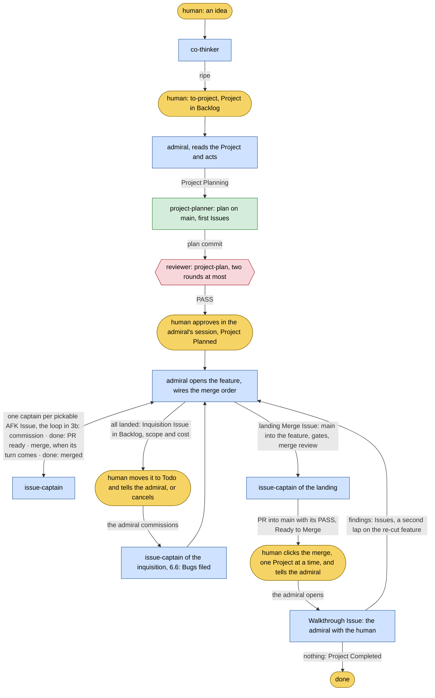
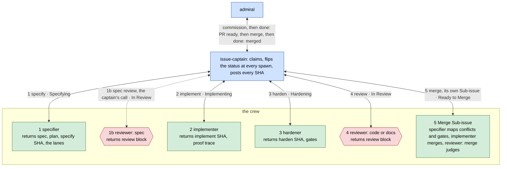
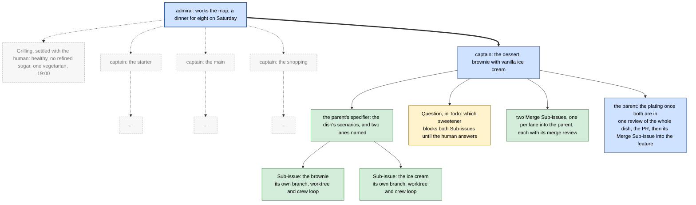
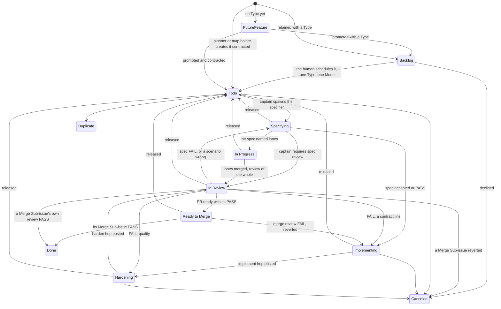
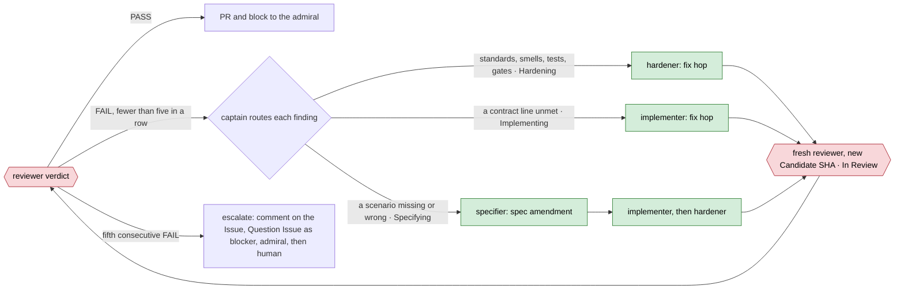
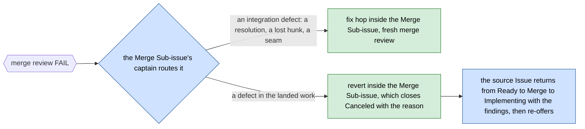
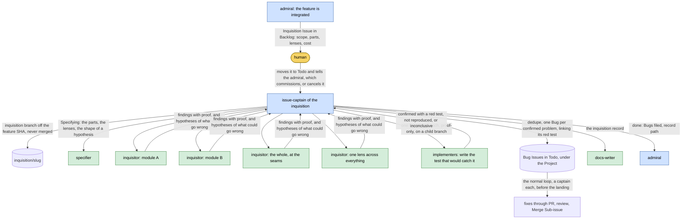
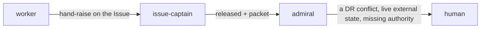
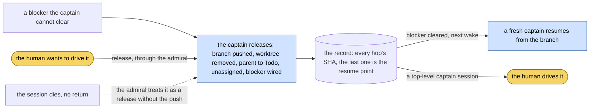
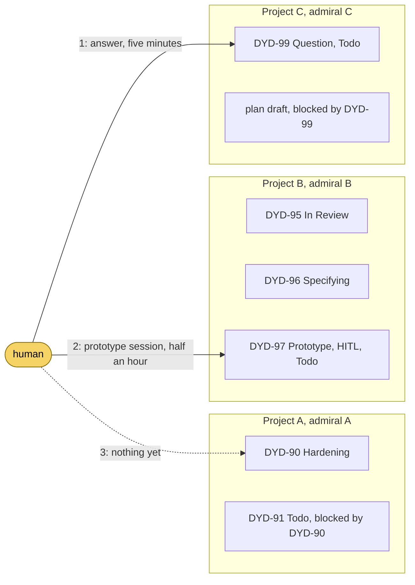

# Control Flow

Every handoff in the dydo 3 operating model, drawn from [DR 045](../project/decisions/045-flow-map-hats-review-tiers-and-working-tree-contract.md),
[DR 046](../project/decisions/046-executable-specifications-specifier-and-commit-addressed-hops.md),
[DR 047](../project/decisions/047-supersymmetry-hop-statuses-merge-issues-and-the-release-protocol.md)
and the [Linear Workspace Standard](../reference/linear-workspace-standard.md): who acts, on which
branch, what leaves them and through which channel, what the other side reads, and what happens when
the happy path breaks. It is the shared truth both sides of every contact must agree with. Section 7
shows a working day with three Projects in flight; section 8 lists what each skill must change to
match.

## How to read it

Node colours name the kind of actor; edge labels name the payload. The payload's channel and the
fields on both sides are in the edge table, section 5.

| Colour | Kind | Meaning |
|---|---|---|
| gold | human | the one person; opens every session that talks to him, acts at the gates |
| blue | hat | what a session is doing now; the map holder at its level |
| green | worker | spawned for one bounded job, returns to its spawner, never talks to the human |
| red | reviewer | a worker whose return is the review block: one rubric, one binding verdict |

Channels: **L** a Linear field, comment or status · **G** a commit, branch or PR · **R** an agent's
return to its spawner, or a message to a returned one · **F** a file in the repository · **C** the
conversation with the human.

## 1. Roster

The actors: every hat and every worker. A hat is top-level when a session wears it; the captain also
compiles as an agent so an admiral can spawn one per Issue.

| Role | Kind | Runs as | Invoked by | Works in | Does | Returns to |
|---|---|---|---|---|---|---|
| human | human | the terminal | — | `main`, where his own commits need no Issue, and any hat | thinks, files Projects, approves plans, answers Questions, confirms inquisitions, clicks the landing one Project at a time, walks through; tells the admiral after each of his board moves | — |
| co-thinker | hat | top-level session | any session with an unripe idea | no branch; DRs and glossary on the current branch | homework, grilling, domain-modeling, recommendation; a DR when the ADR test passes; an atomic Issue with its five fields | a DR (F), a Project through `to-project` (L), an atomic Issue (L) |
| admiral | hat | top-level session, explicit-only | the human, on a Project at any stage | `feature/<slug>` | wakes on a captain's return or the human's word, reads the Project and acts: sends the planner, owns the plan review, puts approval to the human, opens the feature, commissions captains, wires the merge order and re-wires it when a later PR is ready first, sets priority on what waits on the human, runs its wayfinding with the human, proposes the inquisition, files the landing and the walkthrough, closes | the human in its own session (C); the board (L) |
| issue-captain | hat, also agent | top-level for an atomic or HITL Issue; spawned by an admiral for an AFK one | the admiral, or the human's session | `DYD-123-<slug>` in an isolated worktree; `inquisition/<slug>` for an inquisition | claims, flips the status at every spawn, sends the specifier first, divides when the spec says so, directs [specifier] → [implementer] → [hardener] → [reviewer] on the parent or each lane, sets `Ready to Merge` when the PR carries its PASS, runs its Merge Sub-issues, cleans up | the spawner: `done <key>` or `released <key>: <reason>` (R); everything else on the record (L) |
| chief-of-staff | hat | top-level session, explicit-only | the human | none | the bird's-eye view over the admirals: the three lists, grilling open Questions, mediating collisions, sweeping stale state and orphans | the human (C); delivery staged for the admiral (L) |
| research | worker, delegates, web | agent | co-thinker, admiral, issue-captain | reads | one fact a choice waits on, cited; sends scouts | the invoker: one-line answer, destination, unsettled points (R); report as Issue comment (L) or scratch file (F) |
| project-planner | worker | agent | the admiral | the plan file on `main` | fixes the destination, writes the plan, the first pickable Issues as tracer bullets with their blocking edges, and the blocking Questions | the admiral: the plan commit, first Issues, bearings, blockers (R) |
| specifier | worker | agent | issue-captain, on the parent first, then per lane | the Issue branch | spec (scenarios and gates) and plan; names the lanes when the Issue divides; commits the feature files as the `specify` hop; per-kind resource for Bug, Merge, Inquisition | the captain: spec, plan, SHA, review recommendation, lanes (R) |
| implementer | worker | agent | issue-captain | the Issue branch after the specify hop; a Merge Sub-issue; a proof-only lane | makes it work: scenario red, tests red, green, gates; `implement` hop. On a Merge: the merge commit and its resolutions. Proof-only: the test that would catch one hypothesis | the captain: SHA, files, trace of each contract line to its proof, gates (R); for a hypothesis, `confirmed`, `not reproduced` or `inconclusive` |
| hardener | worker | agent | issue-captain, unless the captain's spec declares the hop empty | the Issue branch after the implement hop | makes it good: one-level static gates (HCRAP and cognitive complexity), mutation on code and example values, smells, depth; `harden` hop | the captain: SHA, what was cut or closed, gates incl. mutation (R) |
| docs-writer | worker | agent | issue-captain, for a docs Issue or an inquisition's record | the Issue branch | one documentation change with a witness per claim; the inquisition record | the captain: files, witnesses, `dydo check` (R) |
| reviewer | worker, read-only | agent | admiral, issue-captain | reads a pinned candidate | one rubric: code, tests, docs, project-plan, spec, merge | the invoker: the review block (R), posted on the record and in the PR body (L, G) |
| scout | worker, read-only, web | agent | research | reads one source family | passages back, no conclusions | research (R) |
| inquisitor | worker, read-only | agent | an inquisition's issue-captain | reads the inquisition branch | one part or one lens swept, refuting its own catch; hypotheses of what could go wrong | the inquisition captain: findings with proof, hypotheses (R) |

## 2. Skills that are not actors

Methods run inside the caller's thread and leave nothing of their own; human commands run only when
the human types them.

Agent-invoked methods:

| Method | Reached by | When | Leaves behind |
|---|---|---|---|
| wayfinder | admiral, issue-captain | writing the contracts one level down, working the map, clearing local fog | the map in the Project description; Issues and Sub-issues, wired |
| grilling | co-thinker, chief-of-staff, any Grilling Issue | a plan, decision or idea the human wants stress-tested, one round at a time | answers and reasoning recorded where the work lives |
| domain-modeling | co-thinker, wayfinder | a term keeps sliding, or a choice looks durable enough for a DR | `dydo/glossary.md` entries; a Decision Record |
| codebase-design | specifier, implementer, hardener, reviewer | shaping a module or interface, choosing a seam, judging depth | vocabulary applied, nothing written |
| diagnosing-bugs | the implementer on a Bug's reproduce-or-identify Sub-issue | a defect without a red reproduction | a tight loop that goes red; the regression test; the cause on the Issue |
| prototype | the implementer on a Prototype Issue | how it should look or behave is the open question | `prototype/<name>`, never merged; kept and linked from the Issue until the delivery Issue is `Done`, read by its specifier as input (DR 047 §5) |
| wizard | the captain on an Enablement Issue | steps only the human can perform: credentials, dashboards, cutovers | a bash wizard that walks him through them |
| writing-for-agents | anyone editing a skill or a document an agent reaches by pointer; reviewer(docs) | a prompt file is created, edited, or fires wrong | the edited file |
| self-improvement | any hat; chief-of-staff routes recurring friction to it | the same friction or workaround returns a second time | one small, authorized, testable harness change |

Human commands:

| Command | The human types it when | Produces |
|---|---|---|
| to-project | a co-think is ripe and belongs in Linear | a Project in `Backlog`: title, summary, the intent as description, links to the DR, the glossary entries and the source FutureFeature when one exists; no Issues |
| grill-me | a plan or idea of theirs should be pressed | answers and reasoning, recorded by the hat in play |
| bro | an agent's pitch did not land | the same thing said plainly, with the two glossaries in hand |
| handoff | the session is ending and another agent continues | a handoff document in the scratch directory |
| walkthrough | a Walkthrough Issue is open | the four-part tour: what changed, where to look, how to try it, what reviewers flagged |
| teach | the human wants to learn a topic in the workspace | a mission and its learning records |
| improve-codebase-architecture | the codebase's architecture should be examined | a grilled candidate with its report |

The explicit-only hats admiral and chief-of-staff are also typed by the human; they are actors and
stand in the roster.

## 3. The happy path

The model is supersymmetric: a captain's Issue is a Project one level down. The same Types, the same
statuses and the same chain hold at both levels; only the map holder changes.

### 3a. One Project



### 3b. One Issue

The captain is the connector: every worker is briefed by it and returns to it, and it flips the
Issue's status as it spawns each one. Read the crew left to right for the stages; the status is on
each line.



### 3c. The captain divides its Issue, when the spec says so

The map already divided the destination into Issues. The captain's first act on its Issue is the
specifier on the parent; the spec shows whether the Issue holds separate work that can run at the
same time. One dish stays one Issue.

An example with nothing to explain: a dinner for eight on Saturday.



Charting settled the theme through one Grilling Issue with the human: healthy, no refined sugar, one
vegetarian, food on the table at 19:00. The admiral works that map: three courses cooked in parallel
by three captains, and the shopping, blocked by all three menus. The diagram follows one captain.

- **The dessert's captain divides.** Its specifier writes the dish's scenarios and finds that brownie
  and ice cream are made separately and at the same time, so the captain opens two Sub-issues, each
  with its own branch, worktree and crew loop, and keeps the plating on the parent for when both are
  in. Each lane comes back through its own Merge Sub-issue, one at a time; the dish is reviewed
  once, as a whole.
- **The starter's captain does not.** Its spec names no lane: one dish, one crew loop on the parent.
  Dividing is the exception the work has to earn.
- **The sweetener is a Question.** Both Sub-issues need one, the recipes are silent, and the theme
  rules out sugar. The captain's discovery finds "no refined sugar" on the Grilling and no
  replacement, and research cannot settle a matter of taste, so the captain files a Question
  Sub-issue under the dessert Issue in `Todo`, wired to block both lanes, priority `Medium` since
  two lanes wait. When the human answers, both resume. Had the question been which sweeteners the whole dinner allows, it would have gone to
  the admiral as a Project-level Question, because its answer reaches the other courses.

The rules the captain applies:

| Decision | Rule |
|---|---|
| Specify first | the parent's specifier goes first; its spec names the lanes, or none |
| Lane or parent | separate work that can run at the same time becomes a lane; everything sequential, the joining step, the parent's scenarios, the one review and the PR stay on the parent |
| What a lane carries | its parent's Type and Mode, a bounded outcome, a disjoint owned-path subset, exact gates, a child-key branch off the parent branch, an isolated worktree, its own status and evidence, its own [specifier] → [implementer] → [hardener] → [reviewer] loop |
| What proves a lane | its gates; the parent's scenarios prove the joined result |
| Every merge is a Sub-issue | each lane into the parent, in order, then the parent into the feature: one Merge Sub-issue per merge, with its own merge review; never batched |
| Depth | one level: a lane that needs splitting is replaced by sibling lanes; Merge and map-holder-held Sub-issues are the only other children |
| Local fog | a Question that touches only this Issue is a Sub-issue here, in `Todo`; one whose answer reaches other Issues goes to the admiral |

Step by step, with the Linear status each step leaves behind:

1. **Think.** The human brings an idea; the co-thinker does the homework, grills, fixes the words,
   recommends. Output: a DR when the ADR test passes, or ripe intent.
2. **File.** The human types `to-project`: a Linear Project in `Backlog` with the intent, its links
   and its answers. An atomic Issue is filed by the co-thinker with its five fields, in `Todo`.
3. **Chart.** The admiral reads the Project, sets it `Planning`, and sends the project-planner, which
   commits the plan on `main`, files the first Issues in `Todo`, and returns prepared Question
   packets. The admiral files those Questions in `Todo`, wired, with priority by the standard's guide. The admiral loops a fresh `reviewer(project-plan)` to PASS, two rounds at most; a
   second FAIL goes to the human with the findings as the choice.
4. **Approve.** The human approves in the admiral's session; the plan's status becomes `reviewed`,
   the Project `Planned`.
5. **Open.** The admiral opens `feature/<slug>` from `main`, writes the map into the Project
   description, gives every Issue its base branch and every Issue that merges its final Merge Sub-issue, wired in plan order, and sets the
   Project `In Progress`. Issues in
   `Todo` with no open blocker are pickable.
6. **Claim.** The admiral commissions a captain per pickable AFK Issue; a HITL Issue waits for the
   human to open its captain session. Assignment is the claim; branch, base SHA and worktree path go
   on the Issue before the first edit.
7. **Specify.** The captain spawns the specifier and sets `Specifying`. The specifier writes `## Spec`
   and `## Plan`, commits the feature files, names the lanes, and recommends or waives spec review.
   The captain may require `reviewer(spec)`, setting `In Review` and returning to `Specifying` on
   FAIL.
8. **Shape.** Only when the spec names lanes: the captain opens lane Sub-issues in `Todo`, each with
   its own branch and worktree off the parent branch, plus one Merge Sub-issue per lane, wired in
   order; the parent sits `In Progress` while its lanes run. Section 3c.
9. **Implement, then harden.** `Implementing`, then `Hardening`, unless the captain, through its spec, declared the hop
   empty. Two commits, each SHA posted on the record.
10. **Review.** `In Review`; a fresh reviewer with one rubric pins Contract, Candidate and Base and
    returns the block. PASS binds that candidate under that contract. FAIL sends the record to the
    hop that fixes it.
11. **Offer.** The captain pushes the branch, opens the PR into the feature branch with the block in
    its body, sets `Ready to Merge`, and returns `done <key>: PR ready`.
12. **Merge.** When the Merge Sub-issue's blocker clears, the previous Issue's merge, the admiral
    resumes the captain with one word; when the next PR in plan order is not ready and a ready one
    does not depend on it, the admiral re-wires the order first. Its implementer merges with `--no-ff`; a fresh
    `reviewer(merge)` judges the integrated feature; PASS sets the Sub-issue and the primary `Done`.
    The captain cleans up and returns `done <key>: merged`. PR by PR, in plan order, never batched.
13. **Inquisition (rare).** The admiral files an Inquisition Issue with scope and cost in `Backlog`;
    the human confirms by moving it to `Todo` and telling the admiral; a captain runs it and files
    Bugs, which land through the normal loop before the landing. Section 6.6.
14. **Land.** The admiral files the landing Merge Issue; its captain merges `main` into the feature,
    runs the gates, obtains the merge review that proves the plan's acceptance criteria, opens
    the PR into `main`, sets `Ready to Merge`, and prepares the walkthrough. The human clicks, one
    Project at a time; the PR lands as a merge commit.
15. **Walk through.** The admiral opens the Walkthrough Issue and runs `walkthrough` with the human.
    Findings become Issues and a second lap on the feature branch re-cut from `main` under the same
    name; nothing found sets the Project `Completed` and retires its artifacts.

## 4. States

A delivery Issue's status is the only delivery status, and Linear owns it: twelve statuses in the
standard's order, which Linear draws as progress. The captain alone sets it, flipping at every chain
spawn. An open native blocker makes an Issue blocked in any status; there is no `Blocked` status
and no `Waiting for Human`; `Planning` remains a Project status only.



Who sets what: the captain sets every status of its Issue and Sub-issues; the admiral sets Project
statuses and its own map-holder-held Issues'. A `Question` runs `Todo` → `Done` and `Todo` on it is
the human's turn; `Research`, `Grilling` and `Walkthrough` run `Todo` → `In Progress` → `Done`. A
captain-held Issue runs `Todo` → `Specifying` → `Implementing` → `Hardening` → `In Review` →
`Ready to Merge` → `Done`, with `In Progress` while its lanes run; a Merge Sub-issue runs `Todo` →
`Specifying` → `Implementing` → `In Review` → `Done` and never waits to be merged. An Inquisition
Issue runs `Backlog` → `Todo` (the human's confirmation) → `Specifying` → `In Progress` for the
sweep and the proofs → `Done` when its Bugs are filed and its record written. A Merge Sub-issue
whose review fails on the landed work is reverted and closes `Canceled` with the reason.

## 5. Edges: the contract table

One row per contact. A sender's return must carry every field the receiver's Must-Reads consume;
a field read that nobody returns, or returned that nobody reads, is a finding.

| # | Edge | Channel | Sender returns or writes | Receiver reads | Status set |
|---|---|---|---|---|---|
| 1 | human → co-thinker | C | the idea | about, architecture, glossary | — |
| 2 | co-thinker → repository | F | a Decision Record; a glossary entry | — | — |
| 3 | human → `to-project` → Linear | C, L | the Project: title, summary, intent, decisions taken, out of scope, links to the DR, glossary entries, source FutureFeature | — | Project `Backlog` |
| 4 | co-thinker → Linear (atomic Issue) | L | an Issue with outcome, owned paths, blockers, exact gates, base branch | — | `Todo` |
| 5 | human → admiral | C | the Project, at any stage | the Project, its plan at the governing commit when one exists, every Issue contract, working-tree contract | — |
| 6 | admiral → project-planner | R (spawn) | the Project | the Project, governing DRs, about, architecture, dydo-glossary, writing-good-briefs | Project `Planning` |
| 7 | project-planner → admiral, repository, Linear | R, F, L | the plan commit on `main`; first Issues with all five fields and blocking edges; prepared Question packets naming waiters and recommended priority, for the admiral to file | — | Issues `Todo`; Questions `Todo` |
| 8 | admiral → reviewer(project-plan) | R (spawn) | the plan path at its commit | the plan, the project-planner skill, cited DRs and paths | — |
| 9 | reviewer(project-plan) → admiral, Linear | R, L | the review block, as a Project update | — | — |
| 10 | admiral → human | C | the passing plan, for approval; after two FAILs, the findings as the choice | — | plan `reviewed`; Project `Planned` |
| 11 | admiral → Git, Linear | G, L | `feature/<slug>`; the map in the Project description; base branch and blockers on every Issue, priority on every HITL one; the final Merge Sub-issue of every captain-held Issue that merges, created under it and blocked by the previous one in plan order | — | Project `In Progress` |
| 12 | admiral → issue-captain (AFK) | R (spawn), L | the Issue key; assignment | the Issue's five fields, the plan at its governing commit, working-tree contract | — |
| 13 | human → issue-captain (HITL or atomic) | C, L | the Issue key; assignment | the same | — |
| 13b | issue-captain (top-level) → human, admiral | C, L | `done <key>` or `released <key>: <reason>` in its own session; the human tells the admiral | the record | — |
| 14 | issue-captain → Issue | L, G | branch, base SHA, worktree path | — | — |
| 15 | issue-captain → specifier | R (spawn) | the record to specify, its kind | the record with parent, blockers, comments; the plan section and DRs; working-tree contract; coding-standards; the kind's resource | `Specifying` |
| 16 | specifier → issue-captain | R, L, G | spec, plan, specify SHA, `review recommended \| unnecessary`, the lanes named; `## Spec` and `## Plan` on the record; feature files committed | — | — |
| 17 | issue-captain → Sub-issues | L, G | lane Sub-issues with the parent's Type and Mode, disjoint paths and branches; one Merge Sub-issue per lane; a Question Sub-issue for local fog | — | lanes `Todo`; parent `In Progress` |
| 18 | issue-captain → reviewer(spec), optional | R (spawn) | the record, the spec commit | the spec and plan, the five fields, base SHA, branch, worktree, owned paths, the specifier's commit | `In Review` → `Specifying` on FAIL |
| 19 | issue-captain → implementer | R (spawn) | the Issue with `## Spec` and `## Plan`, the specify commit; the review block when a FAIL sent it | the Issue, the plan, the block, coding-standards, about, architecture, working-tree contract | `Implementing` |
| 20 | implementer → issue-captain | R, G | Issue key, implement SHA, files, each scenario and contract line with its proof or gap, tests with claim and seam, gates with output, adjacent findings | — | — |
| 21 | issue-captain → hardener | R (spawn) | the Issue, the implementer's return; the review block when a FAIL sent it | the Issue with spec and plan and the implementer's return, the block, the plan, standards | `Hardening` |
| 22 | hardener → issue-captain | R, G | Issue key, harden SHA, files, cuts and closures with HCRAP before and after, tests sharpened, gates incl. mutation, out-of-path observations | — | — |
| 23 | issue-captain → docs-writer | R (spawn) | the docs Issue and linked plan, or the inquisition's evidence | the Issue, about, writing-docs | `Implementing` |
| 24 | docs-writer → issue-captain | R | files changed, what each says and why, witnesses, `dydo check` and gate results | — | — |
| 25 | issue-captain → reviewer(code \| docs) | R (spawn) | rubric name, Contract at the specify commit, Candidate SHA, Base SHA | the contract at its governing commit with outcome, scenarios, owned paths, gates; the rubric; the hops | `In Review` |
| 26 | reviewer → issue-captain, record, PR | R, L, G | the review block: Rubric, Reviewer, Contract, Candidate, Base, Verdict, Gates, Findings; observations after it | — | the fixing hop's status on FAIL |
| 27 | issue-captain → Merge Sub-issue (one per lane) | L, R (spawn), G | the lane branch at its PASS SHA; a specifier maps conflicts and gates, an implementer merges it into the parent; a fresh `reviewer(merge)` over the parent | the Merge template's fields: source, target, combined gates | lane `Ready to Merge` at its PASS, `Done` when merged; after the last, parent `In Review` for the review of the whole |
| 28 | issue-captain → admiral | G, L, R | the PR into the feature branch with the block; `done <key>: PR ready` | the record | parent `Ready to Merge` |
| 29 | admiral → issue-captain | R (message) | `merge`, when the Merge Sub-issue's blocker clears, after re-wiring the order when a later PR was ready first; or a fresh commission from the record | the Merge Sub-issue, the PR, the feature SHA | — |
| 30 | issue-captain → Merge Sub-issue (into the feature) | R (spawn), G | a specifier maps the conflicts and combined gates; an implementer merges `--no-ff` and resolves; a fresh `reviewer(merge)` over the integrated feature | the merge commit, both parents, the landed Issue's gates, the plan at its governing commit | Sub-issue and primary `Done` on PASS |
| 31 | reviewer(merge) → issue-captain, Merge Sub-issue | R, L | the review block naming the merge commit and the gates rerun | — | — |
| 32 | issue-captain → admiral | R, L | `done <key>: merged`; worktrees and branches cleaned | — | — |
| 33 | admiral → repository, Linear | F, L | dated plan amendments; new, split, dropped or resequenced Issues; Project-level map-holder-held Issues | — | — |
| 34 | admiral → Linear (inquisition proposal) | L | an Inquisition Issue under the Project: scope, the parts and lenses, the cost, the feature SHA | — | `Backlog` |
| 35 | human → Linear, admiral (inquisition confirmation) | L, C | the Inquisition Issue moved to `Todo`, or `Canceled` with the reason; the human tells the admiral | — | `Todo` |
| 36 | admiral → issue-captain (inquisition) | R (spawn), L | the Inquisition Issue key; assignment | the Issue, the plan at its governing commit, the integrated feature SHA, working-tree contract | — |
| 37 | inquisition captain → Git | G | `inquisition/<slug>` off the feature SHA, never merged; a child branch per proof | — | — |
| 38 | inquisition captain → inquisitors | R (spawn) | one part or one lens each, the scope, the plan, the Issue review evidence | the assignment with its evidence, about, architecture, coding-standards | `In Progress` |
| 39 | inquisitor → inquisition captain | R | findings with `file:line`, severity and proof; hypotheses of what could go wrong, each with the test that would decide it | — | — |
| 40 | inquisition captain → implementer (proof-only) | R (spawn) | one hypothesis, its child branch off the inquisition branch, source read-only | the hypothesis as the Issue, coding-standards | — |
| 41 | implementer → inquisition captain | R, G | `confirmed` with the red test at its SHA, `not reproduced`, or `inconclusive`, with the observation that decided it | — | — |
| 42 | inquisition captain → Linear | L | one Bug per confirmed problem, deduplicated, under the Project with the feature as base branch, linking the red test commit and the Inquisition Issue | — | Bugs `Todo` |
| 43 | inquisition captain → docs-writer | R (spawn) | the evidence: parts and lenses swept, findings, hypotheses and verdicts, Bugs filed | the evidence, writing-docs | — |
| 44 | inquisition captain → admiral | R, L | `done <key>`; Bugs and record path on the Issue, branch deleted | — | Inquisition `Done` |
| 45 | admiral → Linear (landing) | L | the landing Merge Issue: `main` into the feature, gates, merge review with acceptance proof, the PR into `main`, the walkthrough prepared | — | `Todo`, blocked by every open Issue of the Project |
| 46 | landing captain → Git, admiral | G, R | the PR into `main` with its PASS block; `done <key>: PR ready` | — | landing `Ready to Merge` |
| 47 | admiral → human → Git | C, G | the PR to click and the walkthrough that follows; the feature merged into `main` as a merge commit, one Project at a time; the human tells the admiral, which resumes the landing captain to close: `done <key>: merged` | — | landing `Done`, set by its captain |
| 48 | admiral → Walkthrough Issue, human | L, C | the Issue; the four-part tour in the admiral's session | — | `In Progress` → `Done`; findings as Issues; Project `Completed` when none |
| 49 | worker → issue-captain (hand-raise) | R | the question, what was searched, why it blocks, facts or options found | — | — |
| 50 | issue-captain → research | R (spawn) | the question and where the findings land | the question and destination, about, architecture | — |
| 51 | research → issue-captain | R, L or F | one-line answer, destination, unsettled points; the report as an Issue comment or scratch file | — | Research Issue `Done` by the map holder |
| 52 | issue-captain → Linear (local fog) | L | a Question Sub-issue under the delivery parent, wired as blocker, with its priority by the standard's guide; the admiral informed | — | Question `Todo` |
| 53 | issue-captain → admiral (Project-level fog, or any release) | R, L, G | `released <key>: <reason>`; prepared packet and resume SHA on the record, branch pushed, worktree removed, parent unassigned | — | parent `Todo`, blocker wired |
| 54 | admiral → Linear, human | L | a Project-level Question Issue with homework, options, recommendation, wired to every waiter, with its priority by the standard's guide | — | `Todo` |
| 55 | human → Linear, repository, admiral | L, F, C | the answer on the Issue; a DR when it qualifies; the human tells the admiral | — | Question `Done` |
| 56 | admiral (every wake: a return or the human's word) → Linear | L, R | commissions every pickable Issue, blocker-cleared ones included; re-wires the merge order when a later PR is ready first; resumes every Merge Sub-issue whose turn came; re-sets priority on what waits on the human | the board | — |
| 57 | human → chief-of-staff | C | a request for triage | the board: open Questions, the gates, Projects in flight; working-tree contract | — |
| 58 | chief-of-staff → human, Linear | C, L | three lists with recommendations; mechanical fixes; delivery staged on its Project for the admiral | — | — |
| 59 | human → issue-captain (takeover) | C via the admiral, or the sub-agent's transcript | `release`: the captain releases as in row 53; the human opens a top-level captain on the Issue | the record's resume point | parent `Todo` |

## 6. Exceptions

### 6.1 A worker raises a hand

Fog inside an Issue. The rule is fog → discovery → question Issue, and the Question is the last rung.

```mermaid
sequenceDiagram
  participant W as worker
  participant C as issue-captain
  participant R as research
  participant A as admiral
  participant B as Linear
  participant H as human
  W->>C: hand-raise: question, sources searched, why it blocks, options found
  C->>C: bounded discovery: DRs, plan, Issue links, glossary, code, tests
  alt the sources settle it
    C->>W: answer recorded on the Issue, resume
  else a fact outside the tree settles it
    C->>R: the question and the destination
    R-->>C: one-line answer, report on the Issue
    C->>W: resume
  else human judgment, inside this Issue's outcome and the Project destination
    C->>B: Question Sub-issue under the delivery parent, Todo, wired as blocker, with its priority
    C->>A: released, blocked by the Question, the parent back in Todo
    B-->>H: the chief-of-staff or the board surfaces the Question in Todo
    H->>B: answer on the Issue, Question Done, blocker cleared
    H->>A: tells the admiral
    A->>C: next wake, the parent is pickable, re-commission from the record
  else the answer could change other Issues, a shared contract or the destination
    C->>A: released key: reason; prepared packet on the record
    A->>B: Project-level Question Issue in Todo, wired to every waiter, with its priority
    B-->>H: surfaced
    H->>B: answer, a DR when it qualifies
    H->>A: tells the admiral
    A->>A: wayfind: amend the map, re-review when destination, scope, acceptance or architecture moved
    A->>C: re-commission the Issue
  end
```

The contract: the worker never fills a gap with an assumption and never creates an Issue; the captain
owns discovery and the local map; the scope rule in the workspace standard decides local Sub-issue
versus Project-level packet; the admiral alone creates Project-level Questions; the human answers on
the Issue, never in a chat that evaporates; the chief-of-staff surfaces open Questions when the human
asks it to, it is never sent anything.

### 6.2 Review FAIL



The contract: FAIL is binding; the record goes to the status of the hop that fixes it; every
correction is its own commit and the re-review pins the new SHA; a note is a finding; the fifth consecutive FAIL
in one review loop stops the loop rather than softening the verdict. A spec amendment that changes
acceptance is an amendment of the contract and, under a Project, goes to the admiral as a plan
amendment.

### 6.3 The spec or the route is disproved mid-implementation


The contract: a scenario is contract, so the implementer and hardener wire it and never edit it; only
a fresh specifier changes one, and the change is written on the Issue; a contract change above the
Issue's authority climbs the ladder before work resumes.

### 6.4 Plan amendment

The approved plan fixes the destination, not every turn. The admiral creates, splits, drops and
resequences Issues and records dated `## Amendment — <date>` sections without review. An amendment
that changes destination, scope, acceptance criteria or governing architecture goes back through
`reviewer(project-plan)` and human approval before the affected Issues are commissioned. The review
loop is capped at two rounds at any time; the second FAIL is the human's choice.

### 6.5 Merge review FAIL

The merge is an Issue, so the FAIL has an owner.



Revert keeps the feature branch always green and the Issue's own loop intact. Once a later merge
already depends on the failed one, a fix Issue follows it instead of a revert. The same rule holds on
`main` after an atomic Issue's merge.

### 6.6 The inquisition

An Issue like any other, with its own captain, run once the feature is integrated and the human has
confirmed the spend. It does what a review does, at two scales a single review cannot reach: many
read-only eyes on the parts and on the whole, and hypotheses of what could go wrong turned into
tests. It does not gate; it files.



The contract: the admiral proposes by filing the Inquisition Issue in `Backlog` with the parts and
lenses it wants swept and the cost; the human confirms by moving it to `Todo`, which is the gate DR
045 reserves; the captain claims it like any Issue and works on `inquisition/<slug>`, cut from the
integrated feature SHA and deleted when the Issue is `Done`, so nothing on it can leak into the
product; inquisitors are read-only and refute their own catches, and their second product is the
hypothesis list; each hypothesis goes to a proof-only implementer whose only output is a test, red if
the hypothesis holds; a confirmed hypothesis is no longer a hypothesis and joins the findings; the
captain deduplicates and files one Bug per problem under the Project, with the feature as base branch
and the red test's commit as reproduction, so each is picked up by a captain and fixed through the
normal loop; the docs-writer writes the record into `dydo/project/inquisitions/`; the Issue's own
`Done` is the filed Bugs plus the record. There is no PASS or FAIL: Project acceptance is proved by
the landing's merge review, and the Bugs the inquisition filed are landed before the landing.

### 6.7 An atomic Issue

No Project, no admiral. The co-thinker writes the Issue with its five fields; the human opens a
captain on it, or spawns one from any hat, and it claims from `main`, runs the same crew and the same
reviewer, opens the PR into `main`, and merges it through its own final Merge Sub-issue with a fresh
merge review over the integrated state. The human's only gate is the one the captain chooses to
raise. The human's own commits on main are outside the model and need no Issue.

### 6.8 Escalation and precedence



Agents settle operational conflicts themselves, highest first: the human's live instruction, a
Decision Record, the reviewed plan at its governing commit, the Issue contract, coding standards,
existing code. Raising a hand is always a comment on the Issue and, when blocked, a wired Question
Issue in `Todo`; never silent waiting.

### 6.9 A prototype

A Prototype Issue is held by a captain and run for the human: fast sketches that settle a visual or
behavioural choice, co-thinking in code. Its spec names the question and the variants; its
implementer builds them on `prototype/<name>` in its own worktree; there is no hardener, and the
human is the review, in the session. The verdict goes on the Issue with the winning commit. The
branch is kept and linked from the Issue until the delivery Issue is `Done`; that Issue's specifier
reads it as input, never as a base, and nothing on it is ever submitted or merged (DR 047 §5).

### 6.10 A release: blocked, taken over, or dead

One mechanism serves three cases.



On Claude Code a one-off steer needs no release: the human opens the captain's transcript from the
subagent panel and sends it a message there. Anything longer is a release and a top-level captain.
The steer is a Claude Code convenience; the floor on both hosts is the release, and DYD-88 says what
Codex allows.

### 6.11 A Bug

A Bug runs the same chain, mapped by its captain from the template's default: a reproduce-or-identify
Sub-issue first, then a fix. An elusive defect turns identification into hypotheses and proof tests,
as the inquisition does; a trivial one collapses to one record. The reproduction is a scenario when
the defect shows at the product's boundary, else the implementer's red test through diagnosing-bugs,
and it hardens nothing; the fix hardens everything. A Bug the inquisition filed arrives with its red
test at a commit, which the specifier adopts. Under a Project it lands like any Issue; outside one it
is atomic.

### 6.12 The second lap

The walkthrough finds something. The Project stays open: the findings become Issues, the feature
branch is re-cut from `main` under the same name, and the lap runs fixes → Merge Sub-issues → the
landing → another walkthrough, with an inquisition in between only when the human confirms one. The
Project is `Completed` when a walkthrough finds nothing.

## 7. A day with three Projects

The target the model is built for: the human's queue is never empty and never a wall. Every item on
it has its homework done, so the human's minutes go to judgment, taste and direction: an answer, a
reaction to a prototype, an approval, a landing, a walkthrough. Agents never wait on the human
without a `Question` in `Todo`, and the human never waits on agents: when the queue empties, the next
idea goes to a co-thinker. Priority on what waits on him says which comes first: the one that frees
the most AFK work.

Three admirals are three top-level sessions in three terminals, each in its feature worktree; their
captains are sub-agents in Issue worktrees. The human's own terminal wears chief-of-staff to read the
queue, and co-thinker or a HITL Issue's captain, a Prototype's among them, to act on it.

A snapshot at 10:40:

| Project | Status | Session | In flight | Waits on the human |
|---|---|---|---|---|
| A: Reqnroll in DynaDocs | `In Progress` | admiral A | DYD-90 `Hardening`; DYD-91 `Todo`, blocked by DYD-90, whose outcome it builds on | nothing |
| B: Notion export | `In Progress` | admiral B | DYD-95 `In Review`; DYD-96 `Specifying`; DYD-97 Prototype, HITL, `Todo`, `High`: its verdict frees DYD-98 | a captain session on the prototype |
| C: Attention taxonomy | `Planning` | admiral C | the plan draft, blocked by DYD-99 Question in `Todo`, `High`: the whole plan waits | an answer |



The chief-of-staff's three lists at that moment: what blocks work and only the human can unblock,
by priority, DYD-99 and DYD-97, both `High`, the five-minute one first; the gates waiting on the
human, none; routing, the DYD-97 session. Then, in order:

1. **10:40.** The human answers DYD-99 on the Issue and tells admiral C; the blocker clears; its
   planner resumes the plan and the admiral sends it to `reviewer(project-plan)`.
2. **10:45.** The human opens a captain session on DYD-97, the prototype: a UI question, two
   variants to react to in that session. While it runs, DYD-90's hardener returns and its reviewer PASSes; its captain
   opens the PR, sets `Ready to Merge` and returns `done DYD-90: PR ready`; admiral A resumes it for the
   Merge Sub-issue, whose review PASSes; DYD-91's blocker clears and it gets a captain. DYD-95's
   reviewer FAILs on one finding; its captain routes it to the hardener and the Issue shows
   `Hardening`.
3. **11:15.** The prototype's verdict is on DYD-97 with the winning commit and the human tells
   admiral B, which graduates the answer into DYD-98, a delivery Issue. Project C's plan has a PASS
   and waits for approval: the next item on the queue.
4. **11:20.** The human reads the plan's destination and first Issues in admiral C's terminal and
   approves; the Project is `Planned`; admiral C opens the feature branch and commissions its first
   captain.
5. **11:30.** The queue is empty. Admiral A has two captains running, admiral B one and a fresh
   review, admiral C one. The human takes the next raw idea to a co-thinker, or reads the walkthrough
   of what landed since morning.

## 8. Prompt-file propagation — DYD-90

The authored contacts now carry DR 047. DYD-90's specification pins the file boundary and proof;
its candidate receives independent docs review and root contact review before integration.
Completed rows below name the source, not a claim that generated runtime output has been refreshed.

| File | Disposition |
|---|---|
| ~~admiral~~ | Authored: board wakes, planning/review/human approval, captain commissions and merge ordering; no Git; landing and walkthrough. |
| ~~issue-captain~~ | Authored: specify first, lanes/empty hops, statuses, four-field reviewer brief, two-step returns, release and Merge FAIL. |
| ~~project-planner~~ | Authored: agent without delegation; committed plan/first Issues/prepared Questions to admiral; upstream tracer bullets and blockers. |
| ~~specifier~~ | Authored: captain owns status, lanes/empty hops, every delivery kind; Bug, Merge and Inquisition resources. |
| ~~implementer, hardener~~ | Authored: FAIL block Must-Read; merge/proof-only modes; HCRAP and one-level static policy with separate mutation. |
| ~~reviewer~~ | Authored: four-field brief, pinned block on work judged, same merge rubric at every level. |
| ~~docs-writer~~ | Authored: captain invocation, committed evidence and inquisition record. |
| ~~inquisitor~~ | Authored: read-only captain assignment, findings/hypotheses with proof seam; no workflow verify job. |
| ~~chief-of-staff~~ | Authored: Questions plus human gates, priority and released blockers; prototype retention follows delivery completion. |
| ~~co-thinker~~ | Authored: explicit to-project graduation, atomic five-field contract, FutureFeature status. |
| ~~wayfinder~~ | Authored: map holder at both levels, local/Project Question scope, Merge order. |
| ~~to-project, wizard~~ | Authored imports with pinned MIT provenance; wizard shell example shipped through Markdown resource. |
| workflow-inquisition.js, compiler workflow emission | Deferred to DYD-92; retired from current protocol, remaining compiler behavior labelled as legacy. |
| ~~types.json~~ | Inspected: document vocabulary already has inquisition and no workflow; Linear's ten Types are a separate standard. |
| dydo init | Deferred to DYD-86: native nesting depth and host setup proof. |
| ~~working-tree contract~~ | Authored/local twin: captain's Merge at each level, branch exceptions, Specifying, release and merge-commit landing. |
| getting-started | Deferred to DYD-91: framework setup checklist and template registration. |
| dydo.json | Deferred to final integration: two bound model tiers, light unbound, no emitted effort. |
| ~~work-model, task-lifecycle, dydo-glossary~~ | Authored/local prose: current flow, Types, release, Questions, inquisition and supersymmetry. |
| generated skills, agents, framework hashes and host reflection | Deferred to DYD-75 after source/compiler integration; independent review repeats on the compiled surface. |

## Related

- [Work Model](./work-model.md) — the flow map, hats, reviews and inquisition this map expands
- [Linear Issue Lifecycle](./task-lifecycle.md) — what an Issue carries and how it is claimed and merged
- [Working-Tree Contract](../guides/working-tree-contract.md) — branches, worktrees, hops, cleanup
- [Linear Workspace Standard](../reference/linear-workspace-standard.md) — statuses, Types, Mode, templates
- [dydo Glossary](../reference/dydo-glossary.md) — the locked vocabulary
- [DR 047](../project/decisions/047-supersymmetry-hop-statuses-merge-issues-and-the-release-protocol.md) — the decisions this map draws
