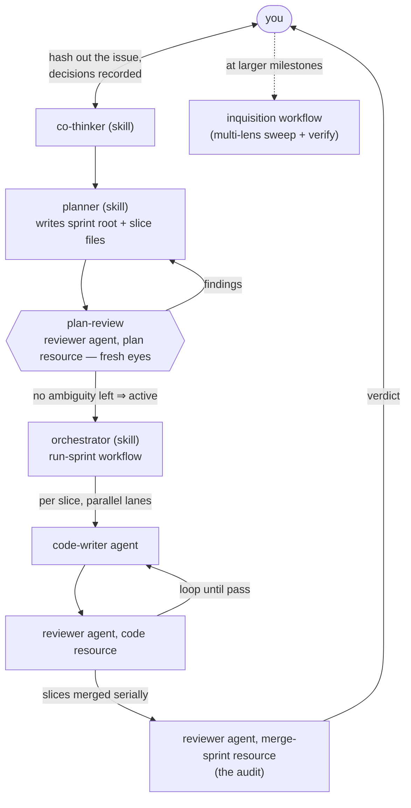

# Work Model

dydo tracks work at four nested levels — **Slice → Sprint → Campaign → Release**. The levels are defined by their **exit gate**, not their size: what has to be true for the work to be *done and sound* is the invariant; span (minutes to weeks) merely follows. This is the ontology behind the records under `dydo/project/` and the shape the Notion view mirrors. (A **task** sits outside this chain: day-to-day tracked work in `project/tasks/`, with its own lifecycle.)

Two concepts are kept strictly orthogonal:

- **Container** — where a unit of work sits in the hierarchy (which sprint, which campaign).
- **Status** — where it is in its lifecycle (`backlog`, `active`, `done`…).

Confusing the two is the classic PM tangle. "Backlog" is a **status**, not a container.

---

## How work runs

Skills are the Tier-1 methodologies you invoke in-session (co-thinker, planner, orchestrator, chief-of-staff); agents are the spawned workers with tool profiles (code-writer, reviewer, test-writer, docs-writer); the reviewer's per-target rubrics are its skill resources.

---

## The Four Levels

Each level is a gate. Work crosses it exactly when the gate's condition is met — nothing about elapsed time or line count.

| Level | One-liner | Exit gate | Typical span |
|---|---|---|---|
| **Slice** | The atom of implementation: one disjoint piece of a sprint | reviewer **PASS** (code resource) | minutes–hours |
| **Sprint** | One plan's execution: root record + slices, `planning → plan-review → active → audit → done` | the **audit** (reviewer, merge-sprint resource) over the merged diff | hours–a day |
| **Campaign** | One goal, many sprints; the unit of "actually done and sound" | **inquisition QA gate** | days |
| **Release** | One ship vehicle; a set of campaigns | **ship checklist** | weeks+ |

### Slice

The smallest scheduled unit: one code → review → pass cycle inside a workflow, executed against its slice file — the self-contained contract the plan gate certified. Its gate is a reviewer verdict.

### Sprint

A sprint is one plan: the root record (specification + slice map) plus its slices. It enters implementation only through the **plan gate** (`plan-review`, fresh eyes), and exits through the **audit** — the whole merged diff reviewed as one unit against the root's acceptance criteria. The human re-engages at the audit verdict to shape what's next.

### Campaign

A campaign is one goal pursued across many sprints — the unit at which we claim work is genuinely finished and trustworthy. Its gate is the **inquisition** (multi-lens sweep, adversarially verified findings). Per-sprint inquisitions are overkill; the QA gate lives at campaign end (on-demand for critical work in between).

### Release

A release is different in kind. Campaigns, sprints, and slices are **work** — they burn down through workflows. A release is a **goal state**: a title, a spec reference, its set of campaigns, and a status, gated by a ship checklist. No workflow machinery runs a release.

---

## Backlog Is a Status, Not a Container

A backlog item is simply a task (or campaign) with `status: backlog` and no sprint attached — a floating unit awaiting scheduling. Floating tasks are explicitly allowed: a backlog task may exist with no sprint container. Nothing needs a dedicated "backlog folder" for this to be true; the status field carries the meaning.

The **idea funnel** rides this: a thought dropped anywhere (a Notion row, an Obsidian file, the `dydo` CLI) lands as a domain-tagged `status: backlog` task file, which a domain orchestrator later pulls from its queue.

---

## Promotion and Demotion Are Cheap

The ontology is fluid; the gates are fixed. A task discovered to be larger than one agent-loop is **promoted** to a sprint or a campaign — a frontmatter edit or a file move, nothing heavier. Work over-scoped can be **demoted** the same way. Because a level *is* its gate, re-leveling a unit just changes which gate it must eventually clear; no work is lost in the move. Treat promotion/demotion as normal and routine, not exceptional.

---

## Issue ≠ Task

An **issue** is an *observed problem* — a bug report, a smell, a gap someone noticed. A **task** is *scheduled work*. They are different objects:

- An issue records that something is wrong; it does not, by itself, schedule a fix.
- A task is a committed unit of work with a gate.
- An issue **spawns** a task when the fix is scheduled.

Keeping them distinct prevents the "every observation becomes an obligation" pile-up and lets triage decide what actually gets scheduled.

---

## Frontmatter Is Canonical, Folders Are Derived

The canonical truth of a work object is its **frontmatter** — `status`, `priority`, `sprint`, `campaign`, `blocked-by`, and so on. Folder placement is **derived presentation**: an ergonomic view (Obsidian-friendly open/closed folders, hub grouping) that dydo regenerates from the frontmatter (the `dydo fix` / hub-regen pattern).

Encoding status in the *path* (e.g. `issues/open/` vs `issues/closed/`) is deliberately avoided: a path encoding fares worse under 3-way merge and Notion sync than a single frontmatter line. Code pools objects from all folders into one list and works from that; folders are for humans, frontmatter is for the machine. Notion mirrors this — one database with a default filter is presentation, not synced structure (Decision 025 §2).

---

## The Gates-Are-Global Lesson

Slicing a sprint into parallel units assumes the slices are **independent**. They are only independent if *nothing they share* can fail for all of them at once.

**Disjoint files do not make disjoint slices.** When repo-wide gates couple all in-tree work — a `dydo check` that validates the whole tree, a test suite that compiles the entire solution, a coverage gate over the full assembly — a slice that trips a shared gate blocks *every* sibling, even ones editing entirely separate files. The seam is the gate, not the file set.

The rule that follows: **sequence tree-shared work.** Parallelize only slices whose gates are genuinely disjoint; when slices share a repo-wide gate, order them so a red gate never strands unrelated work. This is why a docs-only slice (whose gate is `dydo check` plus the doc-consistency tests) is sequenced against source slices that recompile the same tree, rather than run blind against them.

---

## Related

- [Architecture Overview](./architecture.md) — Technical structure of the framework
- [Coding Standards](../guides/coding-standards.md) — How code is written here
- [dydo 2.0 Campaign Roadmap](../project/backlog/dydo-2-campaign-roadmap.md) — A campaign modeled sprint-by-sprint
- [Decision 024](../project/decisions/024-dydo-2-native-pivot.md) — Native pivot: two-tier identity, workflows own orchestration
- [Decision 025](../project/decisions/025-notion-sync-architecture.md) — Canonical files, swappable view adapter (frontmatter-canonical basis)
- [Decision 026](../project/decisions/026-tier1-managers-doctrine.md) — Tier-1 managers; code-writing happens in workflows
- [Decision 028](../project/decisions/028-model-tier-abstraction.md) — Model tiers bound per role/stage by the compiler
